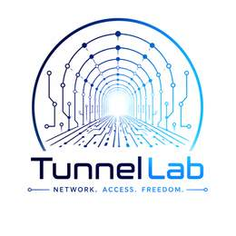

[English](./README.md) | [فارسی](./README.fa_IR.md)

<p align="center">
  
</p>

<h1 align="center">TL Agent</h1>

<p align="center">
  یک محیط مستقل و لوکال برای کدنویسی با Agent؛ مبتنی بر Kilo Code و بدون نیاز به IDE.
</p>

<p align="center">
  <a href="https://github.com/pouramin/TL-Agent/releases"></a>
  <a href="https://github.com/pouramin/TL-Agent/actions/workflows/ci.yml"></a>
  <a href="https://github.com/pouramin/TL-Agent/releases"></a>
  <a href="./LICENSE"></a>
  <a href="https://github.com/Kilo-Org/kilocode"></a>
</p>

**TL Agent** موتور Coding Agent پروژه‌ی Kilo Code را روی کامپیوتر خود کاربر اجرا می‌کند و یک محیط اختصاصی در مرورگر در اختیار او می‌گذارد. می‌توانید بدون بازکردن VS Code، JetBrains، Cursor، Docker یا استفاده از سرور TL Agent با پروژه‌های لوکال، Agentها، مدل‌ها، ابزارها، Permissionها، Sessionها و فایل‌های پروژه کار کنید.

> [!IMPORTANT]
> TL Agent یک پروژه‌ی متن‌باز مستقل است. این پروژه از Kilo Code به‌عنوان Runtime محلی Agent استفاده می‌کند، اما محصول رسمی Kilo Code نیست.

## شروع سریع

### اجرای مستقیم با یک دستور

اگر Node.js و npm روی سیستم نصب هستند، داخل فولدر پروژه‌ای که می‌خواهید روی آن کار کنید این دستور را اجرا کنید:

```bash
npx --yes github:pouramin/TL-Agent
```

لانچر سبک `npx` سیستم‌عامل و معماری را تشخیص می‌دهد، Release مناسب TL Agent را از GitHub دانلود می‌کند، checksum از نوع SHA-256 را بررسی می‌کند، فایل‌ها را به‌صورت محلی cache می‌کند و TL Agent را با همان فولدر فعلی به‌عنوان Project اجرا می‌کند.

### نسخه‌ی Portable

برای نسخه‌ی معمولی Portable نیازی به Node.js نیست. فایل مناسب سیستم خود را از **[GitHub Releases](https://github.com/pouramin/TL-Agent/releases)** دانلود و Extract کنید، سپس اجرا کنید:

```text
Windows:  tl-agent.exe
Linux:    ./tl-agent
macOS:    ./tl-agent
```

فایل‌های Release از قبل نسخه‌ی پین‌شده‌ی Kilo را همراه خود دارند؛ بنابراین کاربر لازم نیست Kilo را جداگانه نصب کند.

## قابلیت‌ها

- **محیط مستقل و لوکال** — رابط Coding Agent در مرورگر و بدون نیاز به IDE.
- **استفاده از API واقعی Kilo برای کدنویسی** — مسیر Production مورد استفاده‌ی کلاینت رسمی Kilo.
- **انتخاب مستقیم فولدر پروژه** — انتخاب Project با Folder Picker خود سیستم‌عامل.
- **انتخاب Agent و Model** — تغییر Agent و مدل‌های در دسترس از داخل Composer.
- **ورود و خروج حساب Kilo** — Device Sign-in و Sign-out برای مدل‌های Hosted در Kilo.
- **نمایش زنده‌ی فعالیت Agent** — دریافت رویدادها با SSE و نمایش جمع‌وجور Reasoning و Toolها.
- **Permission و Question** — پشتیبانی از `once`، `always`، `reject` و سؤال‌های تعاملی Agent.
- **Stop / Abort** — متوقف‌کردن Run فعال از داخل UI.
- **مدیریت Session** — ساخت، تغییر نام و حذف Session برای هر Project.
- **پنل Changes** — مشاهده‌ی فایل‌های تغییرکرده، تعداد خطوط اضافه/حذف‌شده و Patch.
- **File Explorer داخلی** — مرور و Preview فایل‌های Project به‌صورت Read-only داخل خود TL Agent.
- **تنظیمات ظاهری** — حالت System، Dark و Light به‌همراه تغییر اندازه‌ی فونت رابط.
- **معماری Local-first** — اتصال فقط روی Loopback، رمز تصادفی Backend در هر اجرا، کنترل Origin و CSP محدودکننده.
- **بدون Cloud یا Telemetry اختصاصی TL Agent** — ترافیک مدل مستقیماً به Provider تنظیم‌شده در Kilo می‌رود.

## معماری

```text
Browser UI
    │ فقط localhost
    ▼
TL Agent launcher (Go)
    │ reverse proxy محلی و احراز‌شده
    ▼
kilo serve
    │
    ├─ code agent / sessions / tools
    ├─ permissions / questions / SSE events
    ├─ project files / terminal commands
    └─ configured AI providers
```

TL Agent عمداً Runtime خود Kilo را از لایه‌ی UI و Launcher جدا نگه می‌دارد. Project انتخاب‌شده روی سیستم کاربر باقی می‌ماند و TL Agent ترافیک مدل را از زیرساخت خودش عبور نمی‌دهد.

## نسخه‌های قابل دانلود

| سیستم‌عامل | معماری |
| --- | --- |
| Windows | x64 |
| Linux | x64، ARM64 |
| macOS | Intel x64، Apple Silicon ARM64 |

نسخه‌ی Kilo مورد استفاده‌ی TL Agent در فایل [`KILO_VERSION`](./KILO_VERSION) پین شده است.

## ساختار فایل Release

```text
tl-agent/
├─ tl-agent[.exe]
├─ bin/
│  └─ kilo[.exe]
├─ LICENSE
├─ THIRD_PARTY_NOTICES.md
└─ third_party/
   └─ KILO_LICENSE.txt
```

## اجرا از سورس

نیازمندی‌های Development:

- Go 1.23 یا جدیدتر
- فایل اجرایی Kilo در `PATH`، در مسیر `./bin/kilo` کنار Launcher، یا مشخص‌شده با `--kilo`

```bash
go run ./cmd/launcher
```

بازکردن یک Project مشخص:

```bash
go run ./cmd/launcher --project /path/to/project
```

استفاده از یک Kilo binary مشخص:

```bash
go run ./cmd/launcher --kilo /path/to/kilo
```

برای جلوگیری از بازشدن خودکار مرورگر از `--no-browser` استفاده کنید.

## قرارداد Runtime و تست‌ها

TL Agent به‌جای حدس‌زدن شکل Responseها، روی یک قرارداد مشخص از Kilo پین شده است. جزئیات سازگاری فعلی در [`docs/KILO_API_CONTRACT.md`](./docs/KILO_API_CONTRACT.md) ثبت شده است.

CI نسخه‌ی واقعی و پین‌شده‌ی Kilo را دانلود می‌کند و موارد زیر را تست می‌کند:

- Project routing
- endpointهای واقعی Agent، Provider و Session
- Agent اصلی `code`
- اجرای async Prompt
- رویدادهای SSE
- Permission handling
- اجرای واقعی Tool از نوع Write با یک Fake LLM لوکال
- و ساخته‌شدن واقعی فایل روی Disk

## قانون زیرساخت صفر

TL Agent طوری طراحی شده که نگهدارنده برای اجرای پروژه نیازی به پرداخت هزینه‌ی VPS، Hosting، Database، API Gateway، Model inference یا Telemetry backend نداشته باشد. سورس، Issueها، CI، Releaseها و فایل‌های دانلودی روی GitHub قرار دارند.

اگر استفاده از یک مدل یا Provider هزینه داشته باشد، این هزینه مستقیماً بین کاربر و Provider تنظیم‌شده در Kilo است.

## مدل امنیتی

Launcher:

1. رابط را فقط روی Loopback (`127.0.0.1`، `localhost` یا `::1`) اجرا می‌کند؛
2. Kilo را روی Loopback و با یک رمز تصادفی در هر اجرا بالا می‌آورد؛
3. رمز Backend را داخل JavaScript مرورگر قرار نمی‌دهد؛
4. Project انتخاب‌شده را فقط به‌صورت محلی به Kilo Route می‌کند؛
5. درخواست‌های Cross-origin را رد می‌کند؛
6. و رابط را با Content Security Policy محدودکننده سرو می‌کند.

Kilo یک Coding Agent است و در صورت داشتن Permission می‌تواند فایل‌ها را بخواند/بنویسد و Command اجرا کند. TL Agent را فقط روی سیستم و Projectهایی اجرا کنید که به آن‌ها اعتماد دارید.

## وضعیت پروژه

TL Agent در حال حاضر در مرحله‌ی **Early Alpha** است. مسیر اصلی پروژه هم در CI و هم روی یک سیستم واقعی Windows تست شده است:

```text
TL Agent UI
→ Kilo production coding API
→ code agent
→ model
→ tool call
→ permission
→ local file write
→ final assistant response
```

## لایسنس و Attribution

کد Launcher و UI پروژه‌ی TL Agent تحت لایسنس MIT منتشر شده است. Kilo Code نیز MIT است و به‌عنوان یک پروژه‌ی مستقل Upstream باقی می‌ماند. Releaseهایی که Kilo را Bundle می‌کنند، License Notice آن را نیز همراه خود دارند؛ برای جزئیات [`THIRD_PARTY_NOTICES.md`](./THIRD_PARTY_NOTICES.md) را ببینید.

این پروژه با هویت **TunnelLab** توسعه داده می‌شود.
