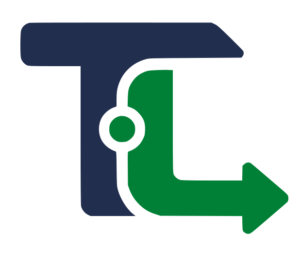
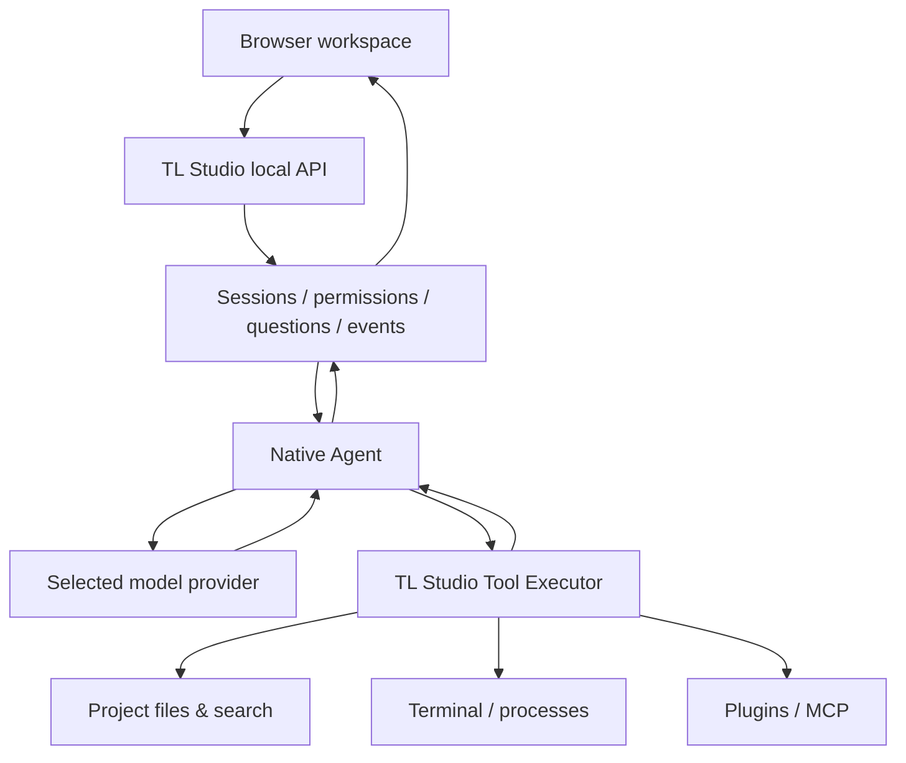

<p align="center" dir="ltr"><a href="./README.md">English</a> · <a href="./README.fa_IR.md">فارسی</a></p>

<p align="center">
  
</p>

<p align="center" dir="rtl">
  <strong>یک محیط کدنویسی محلی با <span dir="ltr">Agent</span> هوش مصنوعی بومی.</strong>
</p>

<p align="center" dir="rtl">
  ویرایش، جست‌وجو، اجرا، <span dir="ltr">Preview</span>، گفتگو، <span dir="ltr">Tool</span>ها و اتصال مدل‌ها؛ همه در یک <span dir="ltr">Workspace</span> محلی روی سیستم خودتان.
</p>

<p align="center">
  <a href="https://www.npmjs.com/package/tl-studio"></a>
  <a href="https://github.com/pouramin/TL-Studio/releases"></a>
  <a href="https://github.com/pouramin/TL-Studio/actions/workflows/ci.yml"></a>
  <a href="https://github.com/pouramin/TL-Studio/releases"></a>
  <a href="./LICENSE"></a>
</p>

<p align="center">
  
  
</p>

---

<h2 dir="rtl" align="right"><span dir="ltr">TL Studio</span> چیست؟</h2>

<p dir="rtl" align="right"><strong><span dir="ltr">TL Studio</span></strong> یک محیط توسعهٔ محلی و مستقل است که حول یک <span dir="ltr">Agent</span> کدنویسی بومی ساخته شده است.</p>

<p dir="rtl" align="right">محیط مرورگری و <span dir="ltr">Backend</span> نوشته‌شده با <span dir="ltr">Go</span> به‌عنوان یک محصول واحد کار می‌کنند. چرخهٔ <span dir="ltr">Agent</span>، <span dir="ltr">Session</span>ها، <span dir="ltr">Tool</span>ها، <span dir="ltr">Permission</span>ها، <span dir="ltr">Provider</span>ها، <span dir="ltr">Credential</span>ها، <span dir="ltr">Process</span>های <span dir="ltr">Terminal</span>، فایل‌های پروژه، <span dir="ltr">Preview</span>، <span dir="ltr">Plugins/MCP</span> و <span dir="ltr">Event</span>های معنایی همگی در اختیار خود <span dir="ltr">TL Studio</span> هستند.</p>

<p dir="rtl" align="right"><span dir="ltr">Session</span>های کدنویسی از طریق <span dir="ltr">Native Agent</span> و <span dir="ltr">Tool Executor</span> خود <span dir="ltr">TL Studio</span> اجرا می‌شوند.</p>

<p dir="rtl" align="right">پروژه روی سیستم کاربر باقی می‌ماند و ترافیک مدل مستقیماً به <span dir="ltr">Provider</span> انتخاب‌شده ارسال می‌شود.</p>

<h2 dir="rtl" align="right">شروع سریع</h2>

<h3 dir="rtl" align="right">اجرا با <span dir="ltr">npm</span></h3>

<p dir="rtl" align="right">اگر <span dir="ltr">Node.js</span> و <span dir="ltr">npm</span> نصب هستند، داخل پوشهٔ پروژه این دستور را اجرا کنید:</p>

```bash
npx --yes tl-studio
```

<p dir="rtl" align="right">پکیج <span dir="ltr">npm Launcher</span> سبک نسخهٔ پایدار متناظر در <span dir="ltr">GitHub Releases</span> است. پلتفرم را تشخیص می‌دهد، <span dir="ltr">Binary</span> رسمی را دانلود می‌کند، <span dir="ltr">SHA-256</span> را بررسی می‌کند، فایل را در <span dir="ltr">Cache</span> محلی نگه می‌دارد و پوشهٔ فعلی را به‌عنوان پروژه باز می‌کند.</p>

<p dir="rtl" align="right">برای اجرا بدون باز شدن خودکار <span dir="ltr">Browser:</span></p>

```bash
npx --yes tl-studio --no-browser
```

<h3 dir="rtl" align="right">نسخهٔ <span dir="ltr">Portable</span></h3>

<p dir="rtl" align="right">نسخهٔ پایدار را از <strong><a href="https://github.com/pouramin/TL-Studio/releases"><span dir="ltr">GitHub Releases</span></a></strong> دانلود و <span dir="ltr">Extract</span> کنید:</p>

```text
Windows   tl-studio.exe
Linux     ./tl-studio
macOS     ./tl-studio
```

<p dir="rtl" align="right">برای باز کردن یک پروژهٔ مشخص:</p>

```bash
tl-studio --project /path/to/project
```

<p dir="rtl" align="right">در <span dir="ltr">Windows:</span></p>

```powershell
.\tl-studio.exe --project C:\path\to\project
```

<h2 dir="rtl" align="right">قابلیت‌های اصلی</h2>

<table dir="rtl">
  <thead>
    <tr>
      <th align="right"></th>
      <th align="right">قابلیت</th>
      <th align="right">توضیح</th>
    </tr>
  </thead>
  <tbody>
    <tr>
      <td align="right">🧠</td>
      <td align="right"><strong><span dir="ltr">Native Agent</span></strong></td>
      <td align="right">چرخهٔ کامل مدل → ابزار → مدل، لغو اجرا، <span dir="ltr">Loop Guard</span>، <span dir="ltr">Persistence</span> و پاسخ نهایی در اختیار <span dir="ltr">TL Studio</span> است.</td>
    </tr>
    <tr>
      <td align="right">🗂️</td>
      <td align="right"><strong><span dir="ltr">Workspace</span></strong></td>
      <td align="right"><span dir="ltr">File Explorer</span>، <span dir="ltr">Monaco Editor</span>، <span dir="ltr">Tab</span>ها، <span dir="ltr">Project Search</span>، عملیات فایل و هماهنگی با تغییرات بیرونی.</td>
    </tr>
    <tr>
      <td align="right">💻</td>
      <td align="right"><strong><span dir="ltr">Terminal</span></strong></td>
      <td align="right">اجرای دستورها در محدودهٔ پروژه، تاریخچهٔ خروجی، <span dir="ltr">Cancellation</span> و پایان <span dir="ltr">Process Tree</span> در سیستم‌های پشتیبانی‌شده.</td>
    </tr>
    <tr>
      <td align="right">👁️</td>
      <td align="right"><strong><span dir="ltr">Live Preview</span></strong></td>
      <td align="right"><span dir="ltr">Preview</span> برای <span dir="ltr">HTML</span>، <span dir="ltr">Markdown</span>، تصویر، <span dir="ltr">PDF</span>، ویدیو، صدا، <span dir="ltr">SVG</span> و متن روی <span dir="ltr">Origin</span> محلی جداگانه.</td>
    </tr>
    <tr>
      <td align="right">🔐</td>
      <td align="right"><strong><span dir="ltr">Permissions</span></strong></td>
      <td align="right"><span dir="ltr">Tool</span>های حساس می‌توانند برای <span dir="ltr">Approval</span> متوقف شوند و <span dir="ltr">Allow Once</span>، <span dir="ltr">Reject</span> یا <span dir="ltr">Rule</span>های <span dir="ltr">Project-scoped</span> داشته باشند.</td>
    </tr>
    <tr>
      <td align="right">💬</td>
      <td align="right"><strong><span dir="ltr">Interactive Questions</span></strong></td>
      <td align="right"><span dir="ltr">Agent</span> می‌تواند سؤال ساختاریافته بپرسد، پاسخ گزینه‌ای یا متن دلخواه بگیرد و همان <span dir="ltr">Run</span> را ادامه دهد.</td>
    </tr>
    <tr>
      <td align="right">🔌</td>
      <td align="right"><strong><span dir="ltr">Providers</span></strong></td>
      <td align="right"><span dir="ltr">Client</span>های مستقیم برای <span dir="ltr">OpenAI-compatible</span>، <span dir="ltr">OpenAI Responses</span>، <span dir="ltr">Anthropic Messages</span> و <span dir="ltr">Google Gemini.</span></td>
    </tr>
    <tr>
      <td align="right">👤</td>
      <td align="right"><strong><span dir="ltr">Provider Accounts</span></strong></td>
      <td align="right"><span dir="ltr">Provider</span>های پشتیبانی‌شده می‌توانند از <span dir="ltr">Account Login</span> استفاده کنند بدون اینکه <span dir="ltr">Credential</span> وارد <span dir="ltr">Browser Code</span> شود.</td>
    </tr>
    <tr>
      <td align="right">🧩</td>
      <td align="right"><strong><span dir="ltr">Plugins</span> / <span dir="ltr">MCP</span></strong></td>
      <td align="right"><span dir="ltr">Tool</span>های خارجی وارد همان <span dir="ltr">Tool Registry</span> و <span dir="ltr">Permission Boundary</span> می‌شوند.</td>
    </tr>
    <tr>
      <td align="right">📚</td>
      <td align="right"><strong><span dir="ltr">Sessions</span></strong></td>
      <td align="right">ساخت، <span dir="ltr">Rename</span>، <span dir="ltr">Resume</span>، <span dir="ltr">Delete</span>، <span dir="ltr">Abort</span>، <span dir="ltr">Persistence</span> و مشاهدهٔ تغییرات هر <span dir="ltr">Session.</span></td>
    </tr>
    <tr>
      <td align="right">📊</td>
      <td align="right"><strong><span dir="ltr">Usage</span></strong></td>
      <td align="right"><span dir="ltr">Activity</span> و <span dir="ltr">Usage</span> هر <span dir="ltr">Session</span> بخشی از مدل معنایی خود <span dir="ltr">TL Studio</span> هستند.</td>
    </tr>
    <tr>
      <td align="right">🏠</td>
      <td align="right"><strong><span dir="ltr">Local-first</span></strong></td>
      <td align="right"><span dir="ltr">Cloud Backend</span>، <span dir="ltr">Database</span>، <span dir="ltr">Hosted Proxy</span> یا <span dir="ltr">Telemetry Service</span> متعلق به <span dir="ltr">TL Studio</span> لازم نیست.</td>
    </tr>
  </tbody>
</table>

<h2 dir="rtl" align="right"><span dir="ltr">Provider</span>ها</h2>

<p dir="rtl" align="right"><span dir="ltr">Credential</span> دستی <span dir="ltr">API</span> و <span dir="ltr">Credential</span> مربوط به <span dir="ltr">Account Login</span> در <span dir="ltr">Slot</span>های جداگانهٔ <span dir="ltr">Credential Vault</span> نگهداری می‌شوند. اتصال حساب می‌تواند در زمان فعال بودن اولویت داشته باشد، اما <span dir="ltr">Sign out</span> کردن حساب <span dir="ltr">API Key</span> دستی موجود را حذف نمی‌کند.</p>

<p dir="rtl" align="right"><span dir="ltr">Secret</span>ها در این محل‌ها ذخیره نمی‌شوند:</p>

```text
providers.json
Browser localStorage
sessionStorage
frontend source
normal local API responses
```

<h3 dir="rtl" align="right"><span dir="ltr">Protocol</span>های <span dir="ltr">Native</span> مدل</h3>

<table dir="rtl">
  <thead>
    <tr>
      <th align="right"><span dir="ltr">Protocol</span></th>
      <th align="right">وضعیت</th>
    </tr>
  </thead>
  <tbody>
    <tr>
      <td align="right"><span dir="ltr">OpenAI-compatible Chat Completions</span></td>
      <td align="right">✅ پشتیبانی می‌شود</td>
    </tr>
    <tr>
      <td align="right"><span dir="ltr">OpenAI Responses</span></td>
      <td align="right">✅ پشتیبانی می‌شود</td>
    </tr>
    <tr>
      <td align="right"><span dir="ltr">Anthropic Messages</span></td>
      <td align="right">✅ پشتیبانی می‌شود</td>
    </tr>
    <tr>
      <td align="right"><span dir="ltr">Google Gemini generateContent</span></td>
      <td align="right">✅ پشتیبانی می‌شود</td>
    </tr>
  </tbody>
</table>

<p dir="rtl" align="right">راه‌اندازی <span dir="ltr">Provider</span> سفارشی <span dir="ltr">Discovery-first</span> است. در حالت عادی فقط <span dir="ltr">API Address</span>، <span dir="ltr">API Type</span> و <span dir="ltr">API Key</span> وارد می‌شوند و <span dir="ltr">TL Studio</span> مدل‌های قابل استفاده را به‌صورت خودکار کشف می‌کند.</p>

<p dir="rtl" align="right">ورود دستی <span dir="ltr">Model</span> فقط به‌عنوان <span dir="ltr">Fallback</span> صریح برای مدل‌های خصوصی یا فهرست‌نشده باقی می‌ماند.</p>

<h3 dir="rtl" align="right">روش اتصال <span dir="ltr">Provider</span>ها</h3>

<p dir="rtl" align="right">کارت‌های <span dir="ltr">Provider</span> بر اساس روش واقعی اتصال هر سرویس عمل می‌کنند؛ نداشتن <span dir="ltr">OAuth</span> به معنی <span dir="ltr">Unavailable</span> بودن نیست.</p>

<table dir="rtl">
  <thead>
    <tr>
      <th align="right"><span dir="ltr">Provider</span></th>
      <th align="right">روش پیش‌فرض</th>
      <th align="right">وضعیت</th>
    </tr>
  </thead>
  <tbody>
    <tr>
      <td align="right"><strong><span dir="ltr">ChatGPT / Codex</span></strong></td>
      <td align="right"><span dir="ltr">Account sign-in</span></td>
      <td align="right">✅ فعال از مسیر رسمی <span dir="ltr">OpenAI Codex</span></td>
    </tr>
    <tr>
      <td align="right"><strong><span dir="ltr">GitHub Copilot</span></strong></td>
      <td align="right"><span dir="ltr">Account sign-in</span></td>
      <td align="right">⏳ جایگاه اتصال حساب آماده است، اما مسیر مدل هنوز <span dir="ltr">Deferred</span> است.</td>
    </tr>
    <tr>
      <td align="right"><strong><span dir="ltr">Claude / Anthropic</span></strong></td>
      <td align="right"><span dir="ltr">Account sign-in + API key</span></td>
      <td align="right">✅ ورود حساب <span dir="ltr">Claude.ai</span> از مسیر رسمی <span dir="ltr">Claude Code</span> و تنظیم مستقل <span dir="ltr">Anthropic API</span></td>
    </tr>
    <tr>
      <td align="right"><strong><span dir="ltr">Google / Gemini</span></strong></td>
      <td align="right"><span dir="ltr">API key</span></td>
      <td align="right">✅ از Endpoint رسمی سازگار با <span dir="ltr">OpenAI</span> برای <span dir="ltr">Gemini API</span> استفاده می‌کند.</td>
    </tr>
    <tr>
      <td align="right"><strong><span dir="ltr">Hugging Face</span></strong></td>
      <td align="right"><span dir="ltr">API token</span></td>
      <td align="right">✅ از <span dir="ltr">Inference Providers</span> سازگار با <span dir="ltr">OpenAI</span> استفاده می‌کند.</td>
    </tr>
    <tr>
      <td align="right"><strong><span dir="ltr">OpenRouter</span></strong></td>
      <td align="right"><span dir="ltr">API key</span></td>
      <td align="right">✅ از <span dir="ltr">OpenRouter API</span> سازگار با <span dir="ltr">OpenAI</span> استفاده می‌کند.</td>
    </tr>
  </tbody>
</table>

<p dir="rtl" align="right">برای <span dir="ltr">Provider</span>های مبتنی بر <span dir="ltr">API</span>، کارت مستقیماً همان فرم موجود و <span dir="ltr">Discovery-first</span> را با Endpoint و Protocol درست باز می‌کند. کارت <span dir="ltr">Claude</span> دو مسیر مستقل دارد: ورود با حساب اشتراکی و تنظیم <span dir="ltr">API key</span>؛ این دو می‌توانند هم‌زمان وجود داشته باشند و یکدیگر را بازنویسی نمی‌کنند.</p>

<h3 dir="rtl" align="right"><span dir="ltr">Claude Web (Free/Pro)</span></h3>

<p dir="rtl" align="right">برای استفاده از <span dir="ltr">Claude Web</span> باید افزونهٔ <span dir="ltr">TL Studio Claude Web Bridge</span> در همان پروفایل <span dir="ltr">Chrome</span> که داخل <span dir="ltr">claude.ai</span> وارد شده نصب باشد. اگر افزونه نصب نباشد، با انتخاب <span dir="ltr">Claude → Web</span> صفحهٔ رسمی و <span dir="ltr">Unlisted</span> افزونه در <span dir="ltr">Chrome Web Store</span> به‌صورت خودکار باز می‌شود؛ کاربر لازم نیست آدرس افزونه را دستی کپی کند. بعد از نصب کافی است به <span dir="ltr">TL Studio</span> برگردد و دوباره <span dir="ltr">Web</span> را انتخاب کند.</p>

<p dir="rtl" align="right">این افزونه فقط مسیر انتقال درخواست و پاسخ مدل است. اطلاعات نشست <span dir="ltr">Claude</span> داخل مرورگر باقی می‌ماند و چرخهٔ <span dir="ltr">Agent</span>، <span dir="ltr">Tool</span>ها، <span dir="ltr">Permission</span>ها، فایل‌های پروژه، <span dir="ltr">Terminal</span>، <span dir="ltr">Session</span>ها و <span dir="ltr">Persistence</span> همچنان در اختیار <span dir="ltr">TL Studio</span> هستند. اگر <span dir="ltr">Chrome</span>، <span dir="ltr">Service Worker</span> افزونهٔ <span dir="ltr">Manifest V3</span> را متوقف یا دوباره راه‌اندازی کند و <span dir="ltr">Pairing</span> حافظه‌ای از بین برود، <span dir="ltr">TL Studio</span> به‌صورت خودکار دوباره <span dir="ltr">Pair</span> می‌کند و همان فرمان انتقال را یک بار تکرار می‌کند.</p>

<p dir="rtl" align="right">راهنمای کامل: <strong><a href="./docs/CLAUDE_WEB.fa_IR.md"><span dir="ltr">Claude Web setup and troubleshooting</span></a></strong></p>

<p dir="rtl" align="right">ورود حساب <span dir="ltr">Claude</span> از فرمان‌های رسمی <span dir="ltr">Claude Code</span> برای <span dir="ltr">login/status/logout</span> استفاده می‌کند. دادهٔ احراز هویت داخل <code dir="ltr">CLAUDE_CONFIG_DIR</code> ایزولهٔ مخصوص <span dir="ltr">TL Studio</span> می‌ماند و برنامه Token خام حساب را نمی‌خواند یا Serialize نمی‌کند. برای Turnهای مدل نیز Toolها و <span dir="ltr">MCP</span> داخلی <span dir="ltr">Claude Code</span> غیرفعال هستند و اجرای Tool، Permission، Session و تغییرات پروژه همچنان در اختیار <span dir="ltr">TL Studio</span> باقی می‌مانند.</p>

<p dir="rtl" align="right">اتصال <span dir="ltr">ChatGPT</span> فقط از Surface رسمی <span dir="ltr">OpenAI Codex CLI/App Server</span> استفاده می‌کند. <span dir="ltr">TL Studio</span> هیچ <span dir="ltr">Cookie</span>، <span dir="ltr">Browser Session</span>، <span dir="ltr">Private OAuth Client</span> یا <span dir="ltr">Backend Token</span> مستندنشده را کپی نمی‌کند. احراز هویت <span dir="ltr">Codex</span> داخل <code dir="ltr">CODEX_HOME</code> ایزولهٔ خود <span dir="ltr">TL Studio</span> باقی می‌ماند و <span dir="ltr">Browser</span> فقط وضعیت معنایی حساب را می‌بیند.</p>

<p dir="rtl" align="right">برای Turnهای مدل مبتنی بر پلن <span dir="ltr">ChatGPT</span>، یک <span dir="ltr">Codex App Server</span> رسمی به‌صورت Warm نگه داشته می‌شود و هر Turn در یک Thread ساختاریافته، ایزوله و <span dir="ltr">Ephemeral</span> اجرا می‌شود. خروجی ساختاریافته دوباره به متن مدل یا <span dir="ltr">TL Studio Tool Call</span> تبدیل می‌شود؛ بنابراین <span dir="ltr">Permission</span>، اجرای Tool، <span dir="ltr">Session Persistence</span> و چرخهٔ بیرونی مدل → ابزار → مدل همچنان متعلق به خود <span dir="ltr">TL Studio</span> هستند.</p>

<p dir="rtl" align="right">اگر فرمان <span dir="ltr">codex</span> روی <span dir="ltr">PATH</span> موجود نباشد، برنامه می‌تواند از <span dir="ltr">npx @openai/codex</span> استفاده کند. برای <span dir="ltr">Claude</span> نیز ابتدا فرمان <span dir="ltr">claude</span> شناسایی می‌شود و در صورت نیاز مسیر <span dir="ltr">npx @anthropic-ai/claude-code</span> یا Executable صریح قابل استفاده است.</p>

<h3 dir="rtl" align="right">تنظیمات <span dir="ltr">Gemini</span> در نسخهٔ <span dir="ltr">Alpha</span></h3>

<p dir="rtl" align="right">در خط توسعهٔ 0.6 این مقادیر غیرمحرمانه مستقیماً از <span dir="ltr">Provider Settings</span> قابل تنظیم هستند:</p>

```text
Google Cloud Project ID
Desktop OAuth Client ID
```

<p dir="rtl" align="right"><span dir="ltr">Access Token</span> و <span dir="ltr">Refresh Token</span> فقط داخل <span dir="ltr">Credential Vault</span> خود <span dir="ltr">TL Studio</span> باقی می‌مانند.</p>

<p dir="rtl" align="right">برای <span dir="ltr">Login</span> دسکتاپ <span dir="ltr">Gemini</span> یک <span dir="ltr">Listener</span> موقت روی <span dir="ltr">Loopback</span> ساخته می‌شود:</p>

```text
127.0.0.1:<random-port>
```

<p dir="rtl" align="right">این <span dir="ltr">Listener</span> مقدار <span dir="ltr">OAuth state</span> را بررسی می‌کند، <span dir="ltr">Flow</span> مبتنی بر <span dir="ltr">PKCE</span> را کامل می‌کند و پس از موفقیت، لغو یا <span dir="ltr">Expiry</span> بسته می‌شود.</p>

<h2 dir="rtl" align="right">معماری</h2>

<p dir="rtl" align="right"><span dir="ltr">TL Studio</span> یک مرز محصول بومی و یکپارچه دارد:</p>


```mermaid
flowchart TD
    UI["Browser workspace"] --> API["TL Studio local API"]
    API --> SESSION["Sessions / permissions / questions / events"]
    SESSION --> AGENT["Native Agent"]
    AGENT --> PROVIDER["Selected model provider"]
    AGENT --> TOOLS["TL Studio Tool Executor"]

    TOOLS --> FILES["Project files & search"]
    TOOLS --> TERM["Terminal / processes"]
    TOOLS --> MCP["Plugins / MCP"]

    PROVIDER --> AGENT
    TOOLS --> AGENT
    AGENT --> SESSION
    SESSION --> UI
```

<p dir="rtl" align="right">بخش‌های زیر مستقیماً در اختیار <span dir="ltr">TL Studio</span> هستند:</p>

<ul dir="rtl">
  <li><span dir="ltr">Workspace</span> و <span dir="ltr">Monaco Editor</span></li>
  <li>فایل‌ها و <span dir="ltr">Project Search</span></li>
  <li><span dir="ltr">Terminal</span> و <span dir="ltr">Process execution</span></li>
  <li><span dir="ltr">Preview</span></li>
  <li><span dir="ltr">Provider Registry</span> و <span dir="ltr">Model Discovery</span></li>
  <li><span dir="ltr">Credential Vault</span></li>
  <li>چرخهٔ <span dir="ltr">Provider Account</span></li>
  <li><span dir="ltr">Native Agent</span></li>
  <li><span dir="ltr">Session</span>ها و <span dir="ltr">Persistence</span></li>
  <li><span dir="ltr">Question</span>ها و <span dir="ltr">Permission</span>ها</li>
  <li><span dir="ltr">Event</span>های معنایی</li>
  <li><span dir="ltr">Tool Registry</span> و <span dir="ltr">Tool Executor</span></li>
  <li><span dir="ltr">Plugins/MCP</span></li>
</ul>

<p dir="rtl" align="right"><span dir="ltr">Protocol</span> پشتیبانی‌نشده با خطای صریح <span dir="ltr">Unsupported Capability</span> متوقف می‌شود.</p>

<p dir="rtl" align="right">جزئیات کامل‌تر:</p>

<p dir="rtl" align="right"><a href="./docs/ARCHITECTURE.md"><span dir="ltr">docs/ARCHITECTURE.md</span></a></p>

<h2 dir="rtl" align="right">مدل امنیتی</h2>

<p dir="rtl" align="right"><span dir="ltr">Control Surface</span> برنامه برای استفادهٔ محلی طراحی شده است:</p>

<ul dir="rtl">
  <li><span dir="ltr">Control UI</span> فقط روی <span dir="ltr">Loopback Bind</span> می‌شود.</li>
  <li><span dir="ltr">Host</span>های غیرمحلی رد می‌شوند.</li>
  <li><span dir="ltr">Origin</span> مرورگر باید با <span dir="ltr">Control Origin</span> محلی یکسان باشد.</li>
  <li>عملیات <span dir="ltr">Filesystem</span> مرز پروژه را <span dir="ltr">enforce</span> می‌کنند.</li>
  <li><span dir="ltr">Traversal</span> و <span dir="ltr">Symlink Escape</span> رد می‌شوند.</li>
  <li><span dir="ltr">Preview</span> از <span dir="ltr">Control Origin</span> جداست.</li>
  <li><span dir="ltr">Secret</span>های <span dir="ltr">Provider</span> وارد <span dir="ltr">Browser Code</span> نمی‌شوند.</li>
  <li><span dir="ltr">Tool</span>های حساس پشت <span dir="ltr">Permission</span> قرار دارند.</li>
</ul>

<p dir="rtl" align="right"><span dir="ltr">Provider</span>های خارجی، <span dir="ltr">Repository</span>ها، <span dir="ltr">Prompt</span>ها، <span dir="ltr">MCP Server</span>ها و <span dir="ltr">Plugin Process</span>ها مرزهای اعتماد مستقل هستند.</p>

<p dir="rtl" align="right"><span dir="ltr">Control Port</span> برنامه را از طریق <span dir="ltr">Public Proxy</span> در معرض اینترنت قرار ندهید.</p>

<p dir="rtl" align="right">جزئیات بیشتر:</p>

<p dir="rtl" align="right"><a href="./SECURITY.md"><span dir="ltr">SECURITY.md</span></a></p>

<h2 dir="rtl" align="right">نسخه‌های قابل اجرا</h2>

<table dir="rtl">
  <thead>
    <tr>
      <th align="right">پلتفرم</th>
      <th align="right">معماری</th>
    </tr>
  </thead>
  <tbody>
    <tr>
      <td align="right"><span dir="ltr">Windows</span></td>
      <td align="right"><span dir="ltr">x64</span></td>
    </tr>
    <tr>
      <td align="right"><span dir="ltr">Linux</span></td>
      <td align="right"><span dir="ltr">x64</span>, <span dir="ltr">ARM64</span></td>
    </tr>
    <tr>
      <td align="right"><span dir="ltr">macOS</span></td>
      <td align="right"><span dir="ltr">Intel x64</span>, <span dir="ltr">Apple Silicon ARM64</span></td>
    </tr>
  </tbody>
</table>

<p dir="rtl" align="right">نسخه‌های پایدار همراه با <span dir="ltr">SHA-256</span> از طریق <strong><a href="https://github.com/pouramin/TL-Studio/releases"><span dir="ltr">GitHub Releases</span></a></strong> منتشر می‌شوند.</p>

<h2 dir="rtl" align="right"><span dir="ltr">Build</span> از <span dir="ltr">Source</span></h2>

<h3 dir="rtl" align="right">نیازمندی‌ها</h3>

```text
Go 1.23+
Node.js 18+
npm
```

<p dir="rtl" align="right">نصب وابستگی‌های توسعهٔ <span dir="ltr">Browser:</span></p>

```bash
npm install --ignore-scripts --no-audit --no-fund
```

<p dir="rtl" align="right"><span dir="ltr">Type-check</span> و <span dir="ltr">Build</span> رابط <span dir="ltr">Browser:</span></p>

```bash
npm run check:web
npm run build:web
```

<p dir="rtl" align="right">اجرای <span dir="ltr">Test</span>ها و <span dir="ltr">Vet:</span></p>

```bash
go test ./...
go vet ./...
```

<p dir="rtl" align="right">اجرای <span dir="ltr">TL Studio:</span></p>

```bash
go run ./cmd/launcher --project /path/to/project
```

<p dir="rtl" align="right">ساخت <span dir="ltr">Binary</span> محلی:</p>

```bash
go build -o tl-studio ./cmd/launcher
```

<p dir="rtl" align="right">در <span dir="ltr">Windows:</span></p>

```powershell
go build -o tl-studio.exe ./cmd/launcher
```

<p dir="rtl" align="right">اجرای عادی برنامه <span dir="ltr">Native</span> است و <span dir="ltr">Flag</span> جداگانه یا <span dir="ltr">Runtime</span> خارجی دیگری لازم ندارد.</p>

<h2 dir="rtl" align="right">اعتبارسنجی</h2>

<p dir="rtl" align="right"><span dir="ltr">Validation</span> خودکار <span dir="ltr">Repository</span> فقط <span dir="ltr">Compilation</span> را بررسی نمی‌کند و مسیرهای اصلی محصول را هم پوشش می‌دهد.</p>

<p dir="rtl" align="right">بررسی‌ها، بسته به نوع تغییر، شامل این موارد هستند:</p>

<ul dir="rtl">
  <li><span dir="ltr">Type-check</span> سخت‌گیرانهٔ <span dir="ltr">TypeScript</span> برای <span dir="ltr">Browser</span></li>
  <li><span dir="ltr">Build</span> نهایی <span dir="ltr">Browser</span></li>
  <li><code dir="ltr">go test ./...</code></li>
  <li><code dir="ltr">go vet ./...</code></li>
  <li><span dir="ltr">Cross-compile</span> برای پلتفرم‌های پشتیبانی‌شده</li>
  <li><span dir="ltr">Native Product Contract</span></li>
  <li><span dir="ltr">Custom Provider Contract</span></li>
  <li><span dir="ltr">Browser Smoke</span></li>
  <li><span dir="ltr">Agent E2E</span></li>
  <li><span dir="ltr">Regression Test</span>های <span dir="ltr">Provider</span></li>
  <li><span dir="ltr">Windows x64 Review Package</span></li>
  <li>بررسی <span dir="ltr">Release</span> و <span dir="ltr">Review Package</span></li>
</ul>

<p dir="rtl" align="right">در <span dir="ltr">CI</span> از <span dir="ltr">Credential</span> واقعی استفاده نمی‌شود و <span dir="ltr">Provider</span>ها با <span dir="ltr">Endpoint</span>های <span dir="ltr">Mock</span> و <span dir="ltr">Contract Test</span> بررسی می‌شوند.</p>

<h2 dir="rtl" align="right">شاخه‌ها و کانال انتشار</h2>

<table dir="rtl">
  <thead>
    <tr>
      <th align="right">شاخه / کانال</th>
      <th align="right">کاربرد</th>
      <th align="right">نسخهٔ فعلی</th>
    </tr>
  </thead>
  <tbody>
    <tr>
      <td align="right"><code dir="ltr">main</code></td>
      <td align="right">نسخهٔ پایدار</td>
      <td align="right"><strong><span dir="ltr">v0.5.0</span></strong></td>
    </tr>
    <tr>
      <td align="right"><code dir="ltr">dev</code></td>
      <td align="right">توسعهٔ فعال</td>
      <td align="right"><strong><span dir="ltr">v0.6.0-alpha.1</span></strong></td>
    </tr>
    <tr>
      <td align="right"><span dir="ltr">Feature Branch</span></td>
      <td align="right">تغییر متمرکز بر پایهٔ <span dir="ltr">dev</span></td>
      <td align="right">کوتاه‌عمر</td>
    </tr>
  </tbody>
</table>

<p dir="rtl" align="right">نسخهٔ پایدار تنها زمانی به <span dir="ltr">main</span> ارتقا پیدا می‌کند که <span dir="ltr">Milestone</span> مربوط <span dir="ltr">Validation</span> خودکار و <span dir="ltr">Review</span> عملی را پشت سر گذاشته باشد.</p>

<p dir="rtl" align="right"><span dir="ltr">Launcher</span> پایدار <span dir="ltr">npm</span> از <span dir="ltr">Release</span> پایدار پیروی می‌کند و <span dir="ltr">Development Build</span>ها به‌صورت جداگانه از <span dir="ltr">dev</span> ساخته می‌شوند.</p>

<h2 dir="rtl" align="right">اصول پروژه</h2>

<ol dir="rtl">
  <li><strong><span dir="ltr">Local-first</span></strong> — <span dir="ltr">Workspace</span> و پروژه روی سیستم خود کاربر باقی می‌مانند.</li>
  <li><strong><span dir="ltr">Native execution</span></strong> — چرخهٔ <span dir="ltr">Agent</span> و <span dir="ltr">Tool</span> متعلق به خود <span dir="ltr">TL Studio</span> است.</li>
  <li><strong>مرز اعتماد شفاف</strong> — <span dir="ltr">Credential</span>ها، <span dir="ltr">Permission</span>ها، <span dir="ltr">Provider</span>ها و <span dir="ltr">Tool</span>های خارجی مرز مشخص دارند.</li>
  <li><strong>مرز قابلیت شفاف</strong> — قابلیت پشتیبانی‌نشده به‌صورت واضح <span dir="ltr">Fail</span> می‌شود و با قابلیت دیگری جایگزین نمی‌شود.</li>
  <li><strong><span dir="ltr">Discovery-first Provider setup</span></strong> — راه‌اندازی <span dir="ltr">Provider</span>های معمول باید تا حد ممکن ساده باشد.</li>
  <li><strong><span dir="ltr">Portable by default</span></strong> — <span dir="ltr">Binary</span> پایدار برای <span dir="ltr">Windows</span>، <span dir="ltr">Linux</span> و <span dir="ltr">macOS</span> منتشر می‌شود.</li>
  <li><strong>بدون زیرساخت اختصاصی پروژه</strong> — <span dir="ltr">Backend</span> میزبانی‌شده، <span dir="ltr">Database</span>، <span dir="ltr">Telemetry Service</span> یا <span dir="ltr">Model Proxy</span> برای استفاده از <span dir="ltr">TL Studio</span> لازم نیست.</li>
</ol>

<h2 dir="rtl" align="right">ساختار <span dir="ltr">Repository</span></h2>

```text
cmd/launcher/          Go application, local APIs, Agent, providers, tools
cmd/launcher/ui/       Browser TypeScript source
docs/                  Architecture and design documentation
media/                 Project branding
packaging/             Release/package support
scripts/               Browser build and launcher tooling
third_party/           Required third-party notices/licenses
```

<p dir="rtl" align="right">اسناد مهم:</p>

<ul dir="rtl">
  <li><a href="./docs/ARCHITECTURE.md">معماری</a></li>
  <li><a href="./SECURITY.md">امنیت</a></li>
  <li><a href="./README.md"><span dir="ltr">README</span> انگلیسی</a></li>
  <li><a href="./THIRD_PARTY_NOTICES.md"><span dir="ltr">Third-party notices</span></a></li>
</ul>

<h2 dir="rtl" align="right"><span dir="ltr">License</span></h2>

<p dir="rtl" align="right"><span dir="ltr">TL Studio</span> تحت <strong><span dir="ltr">MIT License</span></strong> منتشر می‌شود.</p>

<p dir="rtl" align="right">فایل‌های مربوط:</p>

<p dir="rtl" align="right"><a href="./LICENSE"><span dir="ltr">LICENSE</span></a></p>

<p dir="rtl" align="right"><a href="./THIRD_PARTY_NOTICES.md"><span dir="ltr">THIRD_PARTY_NOTICES.md</span></a></p>

---

<p align="center" dir="rtl">
  ساخته‌شده تحت هویت <strong><span dir="ltr">TunnelLab</span></strong>.
</p>
