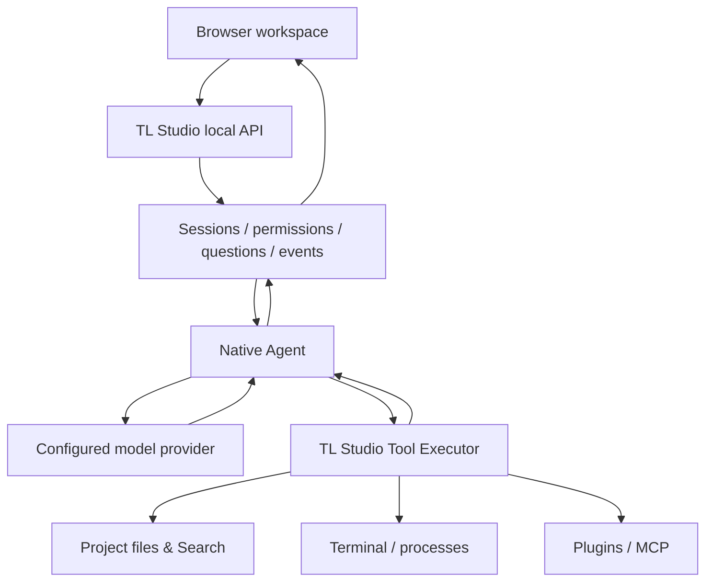

[English](./README.md) · [فارسی](./README.fa_IR.md)

<p align="center">
  
</p>

<p align="center">
  <strong>یک محیط کدنویسی محلی با Agent هوش مصنوعی بومی.</strong>
</p>

<p align="center">
  ویرایش کد، جست‌وجوی پروژه، اجرای دستورها، پیش‌نمایش، استفاده از ابزارها و کار با مدل‌های هوش مصنوعی؛ همه در یک محیط محلی.
</p>

<p align="center">
  <a href="https://www.npmjs.com/package/tl-studio"></a>
  <a href="https://github.com/pouramin/TL-Studio/releases"></a>
  <a href="https://github.com/pouramin/TL-Studio/actions/workflows/ci.yml"></a>
  <a href="https://github.com/pouramin/TL-Studio/releases"></a>
  <a href="./LICENSE"></a>
</p>

<p align="center">
  
  <a href="https://github.com/pouramin/TL-Studio/tree/dev"></a>
</p>

---

## TL Studio چیست؟

**TL Studio** یک محیط توسعهٔ محلی و مستقل است که حول یک Agent کدنویسی بومی ساخته شده است.

محیط مرورگری و Backend نوشته‌شده با Go به‌عنوان یک محصول واحد کار می‌کنند. چرخهٔ Agent، Sessionها، ابزارها، Permissionها، تنظیمات Provider، Credentialها، Processهای Terminal، فایل‌های پروژه، Preview، Plugin/MCP و Eventهای معنایی همگی در اختیار خود TL Studio هستند.

Sessionهای کدنویسی از طریق Native Agent و Tool Executor خود TL Studio اجرا می‌شوند.

پروژه روی سیستم خود کاربر باقی می‌ماند و ترافیک مدل مستقیماً به Provider انتخاب‌شده ارسال می‌شود.

## شروع سریع

### اجرا با npm

اگر Node.js و npm نصب هستند، داخل پوشهٔ پروژه این دستور را اجرا کنید:

```bash
npx --yes tl-studio
```

پکیج npm یک Launcher سبک برای نسخهٔ پایدار متناظر در GitHub Releases است. سیستم‌عامل و معماری را تشخیص می‌دهد، آرشیو رسمی TL Studio را دانلود می‌کند، SHA-256 آن را بررسی می‌کند، فایل را در Cache محلی نگه می‌دارد و پوشهٔ فعلی را به‌عنوان پروژه باز می‌کند.

برای اجرا بدون باز شدن خودکار Browser:

```bash
npx --yes tl-studio --no-browser
```

### نسخهٔ Portable

آخرین نسخهٔ پایدار را از **[GitHub Releases](https://github.com/pouramin/TL-Studio/releases)** دانلود و Extract کنید:

```text
Windows   tl-studio.exe
Linux     ./tl-studio
macOS     ./tl-studio
```

برای باز کردن یک پروژهٔ مشخص:

```bash
tl-studio --project /path/to/project
```

در Windows:

```powershell
.\tl-studio.exe --project C:\path\to\project
```

## قابلیت‌های اصلی

| | قابلیت | توضیح |
| --- | --- | --- |
| 🧠 | **Native Agent** | چرخهٔ کامل مدل → ابزار → مدل، لغو اجرا، Loop Guard، Persistence و پاسخ نهایی در اختیار TL Studio است. |
| 🗂️ | **Workspace** | File Explorer، Monaco Editor، Tabها، ساخت/تغییرنام/حذف/ذخیره و هماهنگی با تغییرات بیرونی فایل‌ها. |
| 🔎 | **Project Search** | جست‌وجوی سراسری در پروژه با فیلترهای Include/Exclude و باز کردن مستقیم نتیجه. |
| 💻 | **Terminal** | اجرای دستورها در محدودهٔ پروژه، تاریخچهٔ خروجی، Stop و پایان Process Tree در سیستم‌های پشتیبانی‌شده. |
| 👁️ | **Live Preview** | پیش‌نمایش HTML، Markdown، تصویر، PDF، SVG، ویدیو، صدا و متن روی Origin محلی جداگانه. |
| 💬 | **Sessions** | ساخت، Resume، Rename، Delete، Abort، Persistence و مشاهدهٔ تغییرات هر Session. |
| ❓ | **Interactive Questions** | Agent می‌تواند متوقف شود، سؤال ساختاریافته بپرسد، پاسخ گزینه‌ای یا متن دلخواه بگیرد و همان اجرا را ادامه دهد. |
| 🔐 | **Permissions** | عملیات حساس می‌توانند نیازمند تأیید، Allow Once، Reject یا Ruleهای Project-scoped باشند. |
| 🔌 | **Providers** | Clientهای مستقیم مدل، Provider سفارشی و Model Discovery. |
| 🔑 | **Credential Vault** | API Keyها خارج از Browser Storage و فایل تعریف Provider نگهداری می‌شوند. |
| 🧩 | **Plugins / MCP** | ابزارهای خارجی وارد همان Tool Registry، مسیر Agent و مرز Permission می‌شوند. |
| 🏠 | **Local-first** | Backend ابری TL Studio، Database برنامه، Model Proxy یا Telemetry Service لازم نیست. |

## پشتیبانی Native از Providerها

نسخهٔ پایدار **v0.5.0** برای Protocolهای زیر Client مستقیم دارد:

| Protocol | وضعیت |
| --- | --- |
| OpenAI-compatible Chat Completions | ✅ پشتیبانی می‌شود |
| OpenAI Responses | ✅ پشتیبانی می‌شود |
| Anthropic Messages | ✅ پشتیبانی می‌شود |

تعریف Providerها در اختیار TL Studio است. API Keyها به‌صورت جداگانه در Credential Vault نگهداری می‌شوند و در این محل‌ها نوشته نمی‌شوند:

```text
providers.json
Browser localStorage
sessionStorage
frontend source
normal local API responses
```

راه‌اندازی Provider سفارشی به‌صورت Discovery-first طراحی شده است: Endpoint، Protocol و Credential را تنظیم می‌کنید و TL Studio فهرست مدل‌ها را از API سازگار کشف می‌کند.

مدل یا Protocol پشتیبانی‌نشده با خطای صریح Unsupported Capability متوقف می‌شود.

### Provider Account

نسخهٔ پایدار **v0.5.0** زیرساخت عمومی Provider Account را به‌عنوان مرز توسعهٔ آینده در اختیار دارد، اما Login با حساب‌های مصرف‌کننده در Runtime پایدار فعال نیست.

Flowهای OAuth خصوصی یا مستندنشده Reverse Engineer نمی‌شوند.

پیاده‌سازی‌های جدید Account Provider روی شاخهٔ توسعه انجام می‌شوند و تنها پس از آماده شدن milestone بعدی وارد نسخهٔ پایدار خواهند شد.

[مشاهدهٔ شاخهٔ dev](https://github.com/pouramin/TL-Studio/tree/dev)

## معماری

TL Studio یک مرز محصول بومی و یکپارچه دارد:


```mermaid
flowchart TD
    UI["Browser workspace"] --> API["TL Studio local API"]
    API --> STATE["Sessions / permissions / questions / events"]
    STATE --> AGENT["Native Agent"]

    AGENT --> PROVIDER["Configured model provider"]
    AGENT --> TOOLS["TL Studio Tool Executor"]

    TOOLS --> FILES["Project files & Search"]
    TOOLS --> TERM["Terminal / processes"]
    TOOLS --> MCP["Plugins / MCP"]

    PROVIDER --> AGENT
    TOOLS --> AGENT
    AGENT --> STATE
    STATE --> UI
```

بخش‌های زیر مستقیماً در اختیار TL Studio هستند:

- Workspace و Monaco Editor
- فایل‌های پروژه و Search
- Terminal و Process execution
- Preview
- Provider Registry و Model Discovery
- Credential Vault
- Native Agent
- Sessionها و Persistence
- Questionها و Permissionها
- Eventهای معنایی
- Tool Registry و Tool Executor
- Plugins/MCP

جزئیات کامل‌تر در این فایل قرار دارد:

[docs/ARCHITECTURE.md](./docs/ARCHITECTURE.md)

## API محلی محصول

Browser فقط با APIهای معنایی خود TL Studio ارتباط دارد، از جمله:

```text
/local/status
/local/health
/local/path
/local/agents
/local/providers/*
/local/provider-accounts*
/local/sessions*
/local/questions*
/local/permissions*
/local/events
/local/plugins*
/local/tools
```

## امنیت

Control Surface برنامه برای استفادهٔ محلی طراحی شده است:

- Control UI فقط روی Loopback Bind می‌شود.
- Hostهای غیرمحلی رد می‌شوند.
- Origin مرورگر باید با Control Origin محلی یکسان باشد.
- عملیات Filesystem مرز پروژه را enforce می‌کنند.
- Traversal و Symlink Escape رد می‌شوند.
- Preview از Control Origin جداست.
- Credentialهای Provider وارد Browser Code نمی‌شوند.
- Toolهای حساس پشت Permission قرار دارند.

Providerهای خارجی، Repositoryها، Promptها، MCP Serverها و Plugin Processها مرزهای اعتماد مستقل هستند.

Control Port برنامه را از طریق Public Proxy در معرض اینترنت قرار ندهید.

جزئیات بیشتر:

[SECURITY.md](./SECURITY.md)

## نسخه‌های قابل اجرا

| پلتفرم | معماری |
| --- | --- |
| Windows | x64 |
| Linux | x64, ARM64 |
| macOS | Intel x64, Apple Silicon ARM64 |

نسخه‌های پایدار همراه با SHA-256 از طریق **[GitHub Releases](https://github.com/pouramin/TL-Studio/releases)** منتشر می‌شوند.

## Build از Source

### نیازمندی‌ها

```text
Go 1.23+
Node.js 18+
npm
```

نصب وابستگی‌های Build رابط Browser:

```bash
npm install --ignore-scripts --no-audit --no-fund
```

Type-check و Build رابط Browser:

```bash
npm run check:web
npm run build:web
```

اجرای Testها و Vet:

```bash
go test ./...
go vet ./...
```

اجرای TL Studio:

```bash
go run ./cmd/launcher --project /path/to/project
```

ساخت Binary محلی:

```bash
go build -o tl-studio ./cmd/launcher
```

در Windows:

```powershell
go build -o tl-studio.exe ./cmd/launcher
```

اجرای عادی برنامه همان Native Execution است و Runtime خارجی دیگری لازم نیست.

## اعتبارسنجی

نسخهٔ پایدار TL Studio به‌عنوان یک محصول کامل تست می‌شود، نه فقط مجموعه‌ای از Packageها.

بررسی‌های Repository، بسته به نوع تغییر، شامل این موارد هستند:

- Type-check سخت‌گیرانهٔ TypeScript برای Browser
- Build نهایی Browser
- `go test ./...`
- `go vet ./...`
- Cross-compile برای پلتفرم‌های پشتیبانی‌شده
- Native Product Contract
- Custom Provider Contract
- Browser Smoke
- Agent E2E
- Windows x64 Review Package
- بررسی Release و Review Package

در تست Providerها از Credential واقعی کاربران استفاده نمی‌شود و Endpointهای Mock جایگزین می‌شوند.

## شاخه‌ها و کانال انتشار

| شاخه | کاربرد |
| --- | --- |
| `main` | نسخهٔ پایدار |
| `dev` | توسعهٔ نسخهٔ بعدی |
| Feature Branch | تغییرات متمرکز برای یک قابلیت یا Milestone |

نسخهٔ پایدار فعلی:

```text
v0.5.0
```

نسخهٔ پایدار فقط پس از عبور از Validation خودکار و Review دستی منتشر می‌شود. تغییرات شاخهٔ dev تا زمان Promotion رسمی، نسخهٔ npm پایدار یا GitHub Release پایدار را تغییر نمی‌دهند.

## اصول پروژه

1. **Local-first** — Source Code و Workspace روی سیستم کاربر باقی می‌مانند.
2. **Native execution** — چرخهٔ Agent و Tool متعلق به خود TL Studio است.
3. **مرز اعتماد شفاف** — Credentialها، Providerها، Permissionها، Repositoryها و Toolهای خارجی مرز مشخص دارند.
4. **مرز قابلیت شفاف** — قابلیت پشتیبانی‌نشده به‌صورت واضح Fail می‌شود و با چیز دیگری جایگزین نمی‌شود.
5. **توزیع Portable** — Build پایدار برای Windows، Linux و macOS منتشر می‌شود.
6. **بدون زیرساخت اختصاصی پروژه** — Backend میزبانی‌شده، Database، Telemetry Service یا Model Proxy برای استفاده از TL Studio لازم نیست.

## ساختار Repository

```text
cmd/launcher/          Go application, local APIs, Agent, providers, tools
cmd/launcher/ui/       Browser TypeScript source
docs/                  Architecture and design documentation
media/                 Project branding
packaging/             Release/package support
scripts/               Browser build and launcher tooling
third_party/           Required third-party notices/licenses
```

اسناد مهم:

- [معماری](./docs/ARCHITECTURE.md)
- [امنیت](./SECURITY.md)
- [README انگلیسی](./README.md)
- [Third-party notices](./THIRD_PARTY_NOTICES.md)
- [شاخهٔ توسعه](https://github.com/pouramin/TL-Studio/tree/dev)

## License

TL Studio تحت **MIT License** منتشر می‌شود.

فایل‌های مربوط:

[LICENSE](./LICENSE)

[THIRD_PARTY_NOTICES.md](./THIRD_PARTY_NOTICES.md)

---

<p align="center">
  ساخته‌شده تحت هویت <strong>TunnelLab</strong>.
</p>
