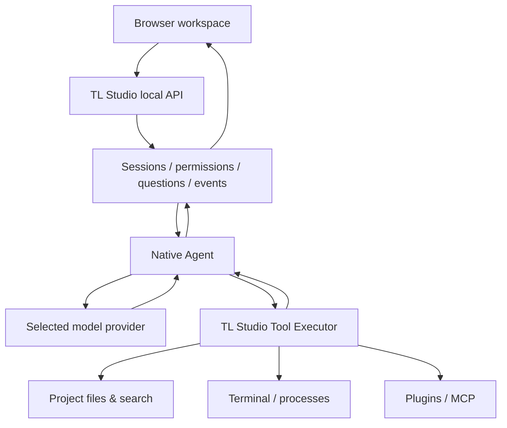

[English](./README.md) · [فارسی](./README.fa_IR.md)

<p align="center">
  
</p>

<p align="center">
  <strong>یک محیط کدنویسی محلی با Agent هوش مصنوعی بومی.</strong>
</p>

<p align="center">
  ویرایش، جست‌وجو، اجرا، Preview، گفتگو، Toolها و اتصال مدل‌ها؛ همه در یک Workspace محلی روی سیستم خودتان.
</p>

<p align="center">
  <a href="https://www.npmjs.com/package/tl-studio"></a>
  <a href="https://github.com/pouramin/TL-Studio/releases"></a>
  <a href="https://github.com/pouramin/TL-Studio/actions/workflows/ci.yml"></a>
  <a href="https://github.com/pouramin/TL-Studio/releases"></a>
  <a href="./LICENSE"></a>
</p>

<p align="center">
  
  
</p>

---

## TL Studio چیست؟

**TL Studio** یک محیط توسعهٔ محلی و مستقل است که حول یک Agent کدنویسی بومی ساخته شده است.

محیط مرورگری و Backend نوشته‌شده با Go به‌عنوان یک محصول واحد کار می‌کنند. چرخهٔ Agent، Sessionها، Toolها، Permissionها، Providerها، Credentialها، Processهای Terminal، فایل‌های پروژه، Preview، Plugins/MCP و Eventهای معنایی همگی در اختیار خود TL Studio هستند.

Sessionهای کدنویسی از طریق Native Agent و Tool Executor خود TL Studio اجرا می‌شوند.

پروژه روی سیستم کاربر باقی می‌ماند و ترافیک مدل مستقیماً به Provider انتخاب‌شده ارسال می‌شود.

## شروع سریع

### اجرا با npm

اگر Node.js و npm نصب هستند، داخل پوشهٔ پروژه این دستور را اجرا کنید:

```bash
npx --yes tl-studio
```

پکیج npm Launcher سبک نسخهٔ پایدار متناظر در GitHub Releases است. پلتفرم را تشخیص می‌دهد، Binary رسمی را دانلود می‌کند، SHA-256 را بررسی می‌کند، فایل را در Cache محلی نگه می‌دارد و پوشهٔ فعلی را به‌عنوان پروژه باز می‌کند.

برای اجرا بدون باز شدن خودکار Browser:

```bash
npx --yes tl-studio --no-browser
```

### نسخهٔ Portable

نسخهٔ پایدار را از **[GitHub Releases](https://github.com/pouramin/TL-Studio/releases)** دانلود و Extract کنید:

```text
Windows   tl-studio.exe
Linux     ./tl-studio
macOS     ./tl-studio
```

برای باز کردن یک پروژهٔ مشخص:

```bash
tl-studio --project /path/to/project
```

در Windows:

```powershell
.\tl-studio.exe --project C:\path\to\project
```

## قابلیت‌های اصلی

| | قابلیت | توضیح |
| --- | --- | --- |
| 🧠 | **Native Agent** | چرخهٔ کامل مدل → ابزار → مدل، لغو اجرا، Loop Guard، Persistence و پاسخ نهایی در اختیار TL Studio است. |
| 🗂️ | **Workspace** | File Explorer، Monaco Editor، Tabها، Project Search، عملیات فایل و هماهنگی با تغییرات بیرونی. |
| 💻 | **Terminal** | اجرای دستورها در محدودهٔ پروژه، تاریخچهٔ خروجی، Cancellation و پایان Process Tree در سیستم‌های پشتیبانی‌شده. |
| 👁️ | **Live Preview** | Preview برای HTML، Markdown، تصویر، PDF، ویدیو، صدا، SVG و متن روی Origin محلی جداگانه. |
| 🔐 | **Permissions** | Toolهای حساس می‌توانند برای Approval متوقف شوند و Allow Once، Reject یا Ruleهای Project-scoped داشته باشند. |
| 💬 | **Interactive Questions** | Agent می‌تواند سؤال ساختاریافته بپرسد، پاسخ گزینه‌ای یا متن دلخواه بگیرد و همان Run را ادامه دهد. |
| 🔌 | **Providers** | Clientهای مستقیم برای OpenAI-compatible، OpenAI Responses، Anthropic Messages و Google Gemini. |
| 👤 | **Provider Accounts** | Providerهای پشتیبانی‌شده می‌توانند از Account Login استفاده کنند بدون اینکه Credential وارد Browser Code شود. |
| 🧩 | **Plugins / MCP** | Toolهای خارجی وارد همان Tool Registry و Permission Boundary می‌شوند. |
| 📚 | **Sessions** | ساخت، Rename، Resume، Delete، Abort، Persistence و مشاهدهٔ تغییرات هر Session. |
| 📊 | **Usage** | Activity و Usage هر Session بخشی از مدل معنایی خود TL Studio هستند. |
| 🏠 | **Local-first** | Cloud Backend، Database، Hosted Proxy یا Telemetry Service متعلق به TL Studio لازم نیست. |

## Providerها

Credential دستی API و Credential مربوط به Account Login در Slotهای جداگانهٔ Credential Vault نگهداری می‌شوند. اتصال حساب می‌تواند در زمان فعال بودن اولویت داشته باشد، اما Sign out کردن حساب API Key دستی موجود را حذف نمی‌کند.

Secretها در این محل‌ها ذخیره نمی‌شوند:

```text
providers.json
Browser localStorage
sessionStorage
frontend source
normal local API responses
```

### Protocolهای Native مدل

| Protocol | وضعیت |
| --- | --- |
| OpenAI-compatible Chat Completions | ✅ پشتیبانی می‌شود |
| OpenAI Responses | ✅ پشتیبانی می‌شود |
| Anthropic Messages | ✅ پشتیبانی می‌شود |
| Google Gemini generateContent | ✅ پشتیبانی می‌شود |

راه‌اندازی Provider سفارشی Discovery-first است. در حالت عادی فقط API Address، API Type و API Key وارد می‌شوند و TL Studio مدل‌های قابل استفاده را به‌صورت خودکار کشف می‌کند.

ورود دستی Model فقط به‌عنوان Fallback صریح برای مدل‌های خصوصی یا فهرست‌نشده باقی می‌ماند.

### Providerهای حسابی

| Provider | Account Login | توضیح |
| --- | --- | --- |
| **OpenRouter** | ✅ فعال | OAuth + PKCE رسمی، Credential مبتنی بر حساب و Model Discovery. |
| **Hugging Face** | ✅ فعال | Public-client OAuth + PKCE، Refresh و Model Discovery برای Inference Providers. |
| **Google / Gemini** | ✅ فعال | Installed-app OAuth + PKCE، Refresh/Revocation، Transport بومی Gemini و پشتیبانی از Google Cloud quota project. |
| **ChatGPT / Codex** | ⏳ Deferred | همچنان یکی از هدف‌های اصلی 0.6 است، اما سطح رسمی فعلی Transport خام مدل موردنیاز برای حفظ مرز Native Agent را ارائه نمی‌کند. |
| **Claude account** | ⏳ Deferred | پشتیبانی Anthropic با API Key بومی است؛ Login حساب مصرف‌کننده منتظر یک قرارداد عمومی و مستند برای Third-party authorization می‌ماند. |
| **GitHub Copilot** | ⏳ Deferred | احراز هویت رسمی وجود دارد، اما مسیر مستند Model Access همچنان به Copilot SDK/runtime وابسته است. |

Providerهای Deferred عمداً در Settings دیده می‌شوند. آن‌ها مرز معماری مشخص هستند، نه قابلیت‌های فراموش‌شده.

### تنظیمات Gemini در نسخهٔ Alpha

در خط توسعهٔ 0.6 این مقادیر غیرمحرمانه مستقیماً از Provider Settings قابل تنظیم هستند:

```text
Google Cloud Project ID
Desktop OAuth Client ID
```

Access Token و Refresh Token فقط داخل Credential Vault خود TL Studio باقی می‌مانند.

برای Login دسکتاپ Gemini یک Listener موقت روی Loopback ساخته می‌شود:

```text
127.0.0.1:<random-port>
```

این Listener مقدار OAuth state را بررسی می‌کند، Flow مبتنی بر PKCE را کامل می‌کند و پس از موفقیت، لغو یا Expiry بسته می‌شود.

## معماری

TL Studio یک مرز محصول بومی و یکپارچه دارد:


```mermaid
flowchart TD
    UI["Browser workspace"] --> API["TL Studio local API"]
    API --> SESSION["Sessions / permissions / questions / events"]
    SESSION --> AGENT["Native Agent"]
    AGENT --> PROVIDER["Selected model provider"]
    AGENT --> TOOLS["TL Studio Tool Executor"]

    TOOLS --> FILES["Project files & search"]
    TOOLS --> TERM["Terminal / processes"]
    TOOLS --> MCP["Plugins / MCP"]

    PROVIDER --> AGENT
    TOOLS --> AGENT
    AGENT --> SESSION
    SESSION --> UI
```

بخش‌های زیر مستقیماً در اختیار TL Studio هستند:

- Workspace و Monaco Editor
- فایل‌ها و Project Search
- Terminal و Process execution
- Preview
- Provider Registry و Model Discovery
- Credential Vault
- چرخهٔ Provider Account
- Native Agent
- Sessionها و Persistence
- Questionها و Permissionها
- Eventهای معنایی
- Tool Registry و Tool Executor
- Plugins/MCP

Protocol پشتیبانی‌نشده با خطای صریح Unsupported Capability متوقف می‌شود.

جزئیات کامل‌تر:

[docs/ARCHITECTURE.md](./docs/ARCHITECTURE.md)

## مدل امنیتی

Control Surface برنامه برای استفادهٔ محلی طراحی شده است:

- Control UI فقط روی Loopback Bind می‌شود.
- Hostهای غیرمحلی رد می‌شوند.
- Origin مرورگر باید با Control Origin محلی یکسان باشد.
- عملیات Filesystem مرز پروژه را enforce می‌کنند.
- Traversal و Symlink Escape رد می‌شوند.
- Preview از Control Origin جداست.
- Secretهای Provider وارد Browser Code نمی‌شوند.
- Toolهای حساس پشت Permission قرار دارند.

Providerهای خارجی، Repositoryها، Promptها، MCP Serverها و Plugin Processها مرزهای اعتماد مستقل هستند.

Control Port برنامه را از طریق Public Proxy در معرض اینترنت قرار ندهید.

جزئیات بیشتر:

[SECURITY.md](./SECURITY.md)

## نسخه‌های قابل اجرا

| پلتفرم | معماری |
| --- | --- |
| Windows | x64 |
| Linux | x64, ARM64 |
| macOS | Intel x64, Apple Silicon ARM64 |

نسخه‌های پایدار همراه با SHA-256 از طریق **[GitHub Releases](https://github.com/pouramin/TL-Studio/releases)** منتشر می‌شوند.

## Build از Source

### نیازمندی‌ها

```text
Go 1.23+
Node.js 18+
npm
```

نصب وابستگی‌های توسعهٔ Browser:

```bash
npm install --ignore-scripts --no-audit --no-fund
```

Type-check و Build رابط Browser:

```bash
npm run check:web
npm run build:web
```

اجرای Testها و Vet:

```bash
go test ./...
go vet ./...
```

اجرای TL Studio:

```bash
go run ./cmd/launcher --project /path/to/project
```

ساخت Binary محلی:

```bash
go build -o tl-studio ./cmd/launcher
```

در Windows:

```powershell
go build -o tl-studio.exe ./cmd/launcher
```

اجرای عادی برنامه Native است و Flag جداگانه یا Runtime خارجی دیگری لازم ندارد.

## اعتبارسنجی

Validation خودکار Repository فقط Compilation را بررسی نمی‌کند و مسیرهای اصلی محصول را هم پوشش می‌دهد.

بررسی‌ها، بسته به نوع تغییر، شامل این موارد هستند:

- Type-check سخت‌گیرانهٔ TypeScript برای Browser
- Build نهایی Browser
- `go test ./...`
- `go vet ./...`
- Cross-compile برای پلتفرم‌های پشتیبانی‌شده
- Native Product Contract
- Custom Provider Contract
- Browser Smoke
- Agent E2E
- Regression Testهای Provider
- Windows x64 Review Package
- بررسی Release و Review Package

در CI از Credential واقعی استفاده نمی‌شود و Providerها با Endpointهای Mock و Contract Test بررسی می‌شوند.

## شاخه‌ها و کانال انتشار

| شاخه / کانال | کاربرد | نسخهٔ فعلی |
| --- | --- | --- |
| `main` | نسخهٔ پایدار | **v0.5.0** |
| `dev` | توسعهٔ فعال | **v0.6.0-alpha.1** |
| Feature Branch | تغییر متمرکز بر پایهٔ dev | کوتاه‌عمر |

نسخهٔ پایدار تنها زمانی به main ارتقا پیدا می‌کند که Milestone مربوط Validation خودکار و Review عملی را پشت سر گذاشته باشد.

Launcher پایدار npm از Release پایدار پیروی می‌کند و Development Buildها به‌صورت جداگانه از dev ساخته می‌شوند.

## اصول پروژه

1. **Local-first** — Workspace و پروژه روی سیستم خود کاربر باقی می‌مانند.
2. **Native execution** — چرخهٔ Agent و Tool متعلق به خود TL Studio است.
3. **مرز اعتماد شفاف** — Credentialها، Permissionها، Providerها و Toolهای خارجی مرز مشخص دارند.
4. **مرز قابلیت شفاف** — قابلیت پشتیبانی‌نشده به‌صورت واضح Fail می‌شود و با قابلیت دیگری جایگزین نمی‌شود.
5. **Discovery-first Provider setup** — راه‌اندازی Providerهای معمول باید تا حد ممکن ساده باشد.
6. **Portable by default** — Binary پایدار برای Windows، Linux و macOS منتشر می‌شود.
7. **بدون زیرساخت اختصاصی پروژه** — Backend میزبانی‌شده، Database، Telemetry Service یا Model Proxy برای استفاده از TL Studio لازم نیست.

## ساختار Repository

```text
cmd/launcher/          Go application, local APIs, Agent, providers, tools
cmd/launcher/ui/       Browser TypeScript source
docs/                  Architecture and design documentation
media/                 Project branding
packaging/             Release/package support
scripts/               Browser build and launcher tooling
third_party/           Required third-party notices/licenses
```

اسناد مهم:

- [معماری](./docs/ARCHITECTURE.md)
- [امنیت](./SECURITY.md)
- [README انگلیسی](./README.md)
- [Third-party notices](./THIRD_PARTY_NOTICES.md)

## License

TL Studio تحت **MIT License** منتشر می‌شود.

فایل‌های مربوط:

[LICENSE](./LICENSE)

[THIRD_PARTY_NOTICES.md](./THIRD_PARTY_NOTICES.md)

---

<p align="center">
  ساخته‌شده تحت هویت <strong>TunnelLab</strong>.
</p>
