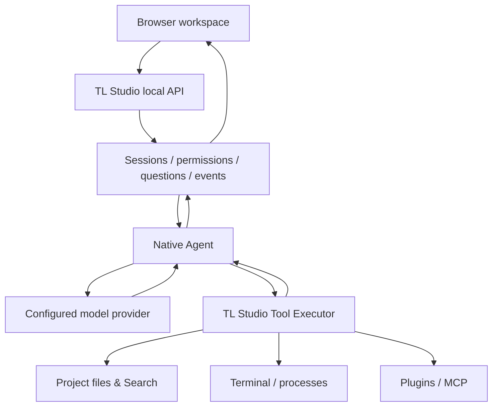

<p align="center" dir="ltr"><a href="./README.md">English</a> · <a href="./README.fa_IR.md">فارسی</a></p>

<p align="center">
  
</p>

<p align="center" dir="rtl">
  <strong>یک محیط کدنویسی محلی با <span dir="ltr">Agent</span> هوش مصنوعی بومی.</strong>
</p>

<p align="center" dir="rtl">
  ویرایش کد، جست‌وجوی پروژه، اجرای دستورها، پیش‌نمایش، استفاده از ابزارها و کار با مدل‌های هوش مصنوعی؛ همه در یک محیط محلی.
</p>

<p align="center">
  <a href="https://www.npmjs.com/package/tl-studio"></a>
  <a href="https://github.com/pouramin/TL-Studio/releases"></a>
  <a href="https://github.com/pouramin/TL-Studio/actions/workflows/ci.yml"></a>
  <a href="https://github.com/pouramin/TL-Studio/releases"></a>
  <a href="./LICENSE"></a>
</p>

<p align="center">
  
  <a href="https://github.com/pouramin/TL-Studio/tree/dev"></a>
</p>

---

<h2 dir="rtl" align="right"><span dir="ltr">TL Studio</span> چیست؟</h2>

<p dir="rtl" align="right"><strong><span dir="ltr">TL Studio</span></strong> یک محیط توسعهٔ محلی و مستقل است که حول یک <span dir="ltr">Agent</span> کدنویسی بومی ساخته شده است.</p>

<p dir="rtl" align="right">محیط مرورگری و <span dir="ltr">Backend</span> نوشته‌شده با <span dir="ltr">Go</span> به‌عنوان یک محصول واحد کار می‌کنند. چرخهٔ <span dir="ltr">Agent</span>، <span dir="ltr">Session</span>ها، ابزارها، <span dir="ltr">Permission</span>ها، تنظیمات <span dir="ltr">Provider</span>، <span dir="ltr">Credential</span>ها، <span dir="ltr">Process</span>های <span dir="ltr">Terminal</span>، فایل‌های پروژه، <span dir="ltr">Preview</span>، <span dir="ltr">Plugin/MCP</span> و <span dir="ltr">Event</span>های معنایی همگی در اختیار خود <span dir="ltr">TL Studio</span> هستند.</p>

<p dir="rtl" align="right"><span dir="ltr">Session</span>های کدنویسی از طریق <span dir="ltr">Native Agent</span> و <span dir="ltr">Tool Executor</span> خود <span dir="ltr">TL Studio</span> اجرا می‌شوند.</p>

<p dir="rtl" align="right">پروژه روی سیستم خود کاربر باقی می‌ماند و ترافیک مدل مستقیماً به <span dir="ltr">Provider</span> انتخاب‌شده ارسال می‌شود.</p>

<h2 dir="rtl" align="right">شروع سریع</h2>

<h3 dir="rtl" align="right">اجرا با <span dir="ltr">npm</span></h3>

<p dir="rtl" align="right">اگر <span dir="ltr">Node.js</span> و <span dir="ltr">npm</span> نصب هستند، داخل پوشهٔ پروژه این دستور را اجرا کنید:</p>

```bash
npx --yes tl-studio
```

<p dir="rtl" align="right">پکیج <span dir="ltr">npm</span> یک <span dir="ltr">Launcher</span> سبک برای نسخهٔ پایدار متناظر در <span dir="ltr">GitHub Releases</span> است. سیستم‌عامل و معماری را تشخیص می‌دهد، آرشیو رسمی <span dir="ltr">TL Studio</span> را دانلود می‌کند، <span dir="ltr">SHA-256</span> آن را بررسی می‌کند، فایل را در <span dir="ltr">Cache</span> محلی نگه می‌دارد و پوشهٔ فعلی را به‌عنوان پروژه باز می‌کند.</p>

<p dir="rtl" align="right">برای اجرا بدون باز شدن خودکار <span dir="ltr">Browser:</span></p>

```bash
npx --yes tl-studio --no-browser
```

<h3 dir="rtl" align="right">نسخهٔ <span dir="ltr">Portable</span></h3>

<p dir="rtl" align="right">آخرین نسخهٔ پایدار را از <strong><a href="https://github.com/pouramin/TL-Studio/releases"><span dir="ltr">GitHub Releases</span></a></strong> دانلود و <span dir="ltr">Extract</span> کنید:</p>

```text
Windows   tl-studio.exe
Linux     ./tl-studio
macOS     ./tl-studio
```

<p dir="rtl" align="right">برای باز کردن یک پروژهٔ مشخص:</p>

```bash
tl-studio --project /path/to/project
```

<p dir="rtl" align="right">در <span dir="ltr">Windows:</span></p>

```powershell
.\tl-studio.exe --project C:\path\to\project
```

<h2 dir="rtl" align="right">قابلیت‌های اصلی</h2>

<table dir="rtl">
  <thead>
    <tr>
      <th align="right"></th>
      <th align="right">قابلیت</th>
      <th align="right">توضیح</th>
    </tr>
  </thead>
  <tbody>
    <tr>
      <td align="right">🧠</td>
      <td align="right"><strong><span dir="ltr">Native Agent</span></strong></td>
      <td align="right">چرخهٔ کامل مدل → ابزار → مدل، لغو اجرا، <span dir="ltr">Loop Guard</span>، <span dir="ltr">Persistence</span> و پاسخ نهایی در اختیار <span dir="ltr">TL Studio</span> است.</td>
    </tr>
    <tr>
      <td align="right">🗂️</td>
      <td align="right"><strong><span dir="ltr">Workspace</span></strong></td>
      <td align="right"><span dir="ltr">File Explorer</span>، <span dir="ltr">Monaco Editor</span>، <span dir="ltr">Tab</span>ها، ساخت/تغییرنام/حذف/ذخیره و هماهنگی با تغییرات بیرونی فایل‌ها.</td>
    </tr>
    <tr>
      <td align="right">🔎</td>
      <td align="right"><strong><span dir="ltr">Project Search</span></strong></td>
      <td align="right">جست‌وجوی سراسری در پروژه با فیلترهای <span dir="ltr">Include/Exclude</span> و باز کردن مستقیم نتیجه.</td>
    </tr>
    <tr>
      <td align="right">💻</td>
      <td align="right"><strong><span dir="ltr">Terminal</span></strong></td>
      <td align="right">اجرای دستورها در محدودهٔ پروژه، تاریخچهٔ خروجی، <span dir="ltr">Stop</span> و پایان <span dir="ltr">Process Tree</span> در سیستم‌های پشتیبانی‌شده.</td>
    </tr>
    <tr>
      <td align="right">👁️</td>
      <td align="right"><strong><span dir="ltr">Live Preview</span></strong></td>
      <td align="right">پیش‌نمایش <span dir="ltr">HTML</span>، <span dir="ltr">Markdown</span>، تصویر، <span dir="ltr">PDF</span>، <span dir="ltr">SVG</span>، ویدیو، صدا و متن روی <span dir="ltr">Origin</span> محلی جداگانه.</td>
    </tr>
    <tr>
      <td align="right">💬</td>
      <td align="right"><strong><span dir="ltr">Sessions</span></strong></td>
      <td align="right">ساخت، <span dir="ltr">Resume</span>، <span dir="ltr">Rename</span>، <span dir="ltr">Delete</span>، <span dir="ltr">Abort</span>، <span dir="ltr">Persistence</span> و مشاهدهٔ تغییرات هر <span dir="ltr">Session.</span></td>
    </tr>
    <tr>
      <td align="right">❓</td>
      <td align="right"><strong><span dir="ltr">Interactive Questions</span></strong></td>
      <td align="right"><span dir="ltr">Agent</span> می‌تواند متوقف شود، سؤال ساختاریافته بپرسد، پاسخ گزینه‌ای یا متن دلخواه بگیرد و همان اجرا را ادامه دهد.</td>
    </tr>
    <tr>
      <td align="right">🔐</td>
      <td align="right"><strong><span dir="ltr">Permissions</span></strong></td>
      <td align="right">عملیات حساس می‌توانند نیازمند تأیید، <span dir="ltr">Allow Once</span>، <span dir="ltr">Reject</span> یا <span dir="ltr">Rule</span>های <span dir="ltr">Project-scoped</span> باشند.</td>
    </tr>
    <tr>
      <td align="right">🔌</td>
      <td align="right"><strong><span dir="ltr">Providers</span></strong></td>
      <td align="right"><span dir="ltr">Client</span>های مستقیم مدل، <span dir="ltr">Provider</span> سفارشی و <span dir="ltr">Model Discovery.</span></td>
    </tr>
    <tr>
      <td align="right">🔑</td>
      <td align="right"><strong><span dir="ltr">Credential Vault</span></strong></td>
      <td align="right"><span dir="ltr">API Key</span>ها خارج از <span dir="ltr">Browser Storage</span> و فایل تعریف <span dir="ltr">Provider</span> نگهداری می‌شوند.</td>
    </tr>
    <tr>
      <td align="right">🧩</td>
      <td align="right"><strong><span dir="ltr">Plugins</span> / <span dir="ltr">MCP</span></strong></td>
      <td align="right">ابزارهای خارجی وارد همان <span dir="ltr">Tool Registry</span>، مسیر <span dir="ltr">Agent</span> و مرز <span dir="ltr">Permission</span> می‌شوند.</td>
    </tr>
    <tr>
      <td align="right">🏠</td>
      <td align="right"><strong><span dir="ltr">Local-first</span></strong></td>
      <td align="right"><span dir="ltr">Backend</span> ابری <span dir="ltr">TL Studio</span>، <span dir="ltr">Database</span> برنامه، <span dir="ltr">Model Proxy</span> یا <span dir="ltr">Telemetry Service</span> لازم نیست.</td>
    </tr>
  </tbody>
</table>

<h2 dir="rtl" align="right">پشتیبانی <span dir="ltr">Native</span> از <span dir="ltr">Provider</span>ها</h2>

<p dir="rtl" align="right">نسخهٔ پایدار <strong><span dir="ltr">v0.5.0</span></strong> برای <span dir="ltr">Protocol</span>های زیر <span dir="ltr">Client</span> مستقیم دارد:</p>

<table dir="rtl">
  <thead>
    <tr>
      <th align="right"><span dir="ltr">Protocol</span></th>
      <th align="right">وضعیت</th>
    </tr>
  </thead>
  <tbody>
    <tr>
      <td align="right"><span dir="ltr">OpenAI-compatible Chat Completions</span></td>
      <td align="right">✅ پشتیبانی می‌شود</td>
    </tr>
    <tr>
      <td align="right"><span dir="ltr">OpenAI Responses</span></td>
      <td align="right">✅ پشتیبانی می‌شود</td>
    </tr>
    <tr>
      <td align="right"><span dir="ltr">Anthropic Messages</span></td>
      <td align="right">✅ پشتیبانی می‌شود</td>
    </tr>
  </tbody>
</table>

<p dir="rtl" align="right">تعریف <span dir="ltr">Provider</span>ها در اختیار <span dir="ltr">TL Studio</span> است. <span dir="ltr">API Key</span>ها به‌صورت جداگانه در <span dir="ltr">Credential Vault</span> نگهداری می‌شوند و در این محل‌ها نوشته نمی‌شوند:</p>

```text
providers.json
Browser localStorage
sessionStorage
frontend source
normal local API responses
```

<p dir="rtl" align="right">راه‌اندازی <span dir="ltr">Provider</span> سفارشی به‌صورت <span dir="ltr">Discovery-first</span> طراحی شده است: <span dir="ltr">Endpoint</span>، <span dir="ltr">Protocol</span> و <span dir="ltr">Credential</span> را تنظیم می‌کنید و <span dir="ltr">TL Studio</span> فهرست مدل‌ها را از <span dir="ltr">API</span> سازگار کشف می‌کند.</p>

<p dir="rtl" align="right">مدل یا <span dir="ltr">Protocol</span> پشتیبانی‌نشده با خطای صریح <span dir="ltr">Unsupported Capability</span> متوقف می‌شود.</p>

<h3 dir="rtl" align="right"><span dir="ltr">Provider Account</span></h3>

<p dir="rtl" align="right">نسخهٔ پایدار <strong><span dir="ltr">v0.5.0</span></strong> زیرساخت عمومی <span dir="ltr">Provider Account</span> را به‌عنوان مرز توسعهٔ آینده در اختیار دارد، اما <span dir="ltr">Login</span> با حساب‌های مصرف‌کننده در <span dir="ltr">Runtime</span> پایدار فعال نیست.</p>

<p dir="rtl" align="right"><span dir="ltr">Flow</span>های <span dir="ltr">OAuth</span> خصوصی یا مستندنشده <span dir="ltr">Reverse Engineer</span> نمی‌شوند.</p>

<p dir="rtl" align="right">پیاده‌سازی‌های جدید <span dir="ltr">Account Provider</span> روی شاخهٔ توسعه انجام می‌شوند و تنها پس از آماده شدن <span dir="ltr">milestone</span> بعدی وارد نسخهٔ پایدار خواهند شد.</p>

<p dir="rtl" align="right"><a href="https://github.com/pouramin/TL-Studio/tree/dev">مشاهدهٔ شاخهٔ <span dir="ltr">dev</span></a></p>

<h2 dir="rtl" align="right">معماری</h2>

<p dir="rtl" align="right"><span dir="ltr">TL Studio</span> یک مرز محصول بومی و یکپارچه دارد:</p>


```mermaid
flowchart TD
    UI["Browser workspace"] --> API["TL Studio local API"]
    API --> STATE["Sessions / permissions / questions / events"]
    STATE --> AGENT["Native Agent"]

    AGENT --> PROVIDER["Configured model provider"]
    AGENT --> TOOLS["TL Studio Tool Executor"]

    TOOLS --> FILES["Project files & Search"]
    TOOLS --> TERM["Terminal / processes"]
    TOOLS --> MCP["Plugins / MCP"]

    PROVIDER --> AGENT
    TOOLS --> AGENT
    AGENT --> STATE
    STATE --> UI
```

<p dir="rtl" align="right">بخش‌های زیر مستقیماً در اختیار <span dir="ltr">TL Studio</span> هستند:</p>

<ul dir="rtl">
  <li><span dir="ltr">Workspace</span> و <span dir="ltr">Monaco Editor</span></li>
  <li>فایل‌های پروژه و <span dir="ltr">Search</span></li>
  <li><span dir="ltr">Terminal</span> و <span dir="ltr">Process execution</span></li>
  <li><span dir="ltr">Preview</span></li>
  <li><span dir="ltr">Provider Registry</span> و <span dir="ltr">Model Discovery</span></li>
  <li><span dir="ltr">Credential Vault</span></li>
  <li><span dir="ltr">Native Agent</span></li>
  <li><span dir="ltr">Session</span>ها و <span dir="ltr">Persistence</span></li>
  <li><span dir="ltr">Question</span>ها و <span dir="ltr">Permission</span>ها</li>
  <li><span dir="ltr">Event</span>های معنایی</li>
  <li><span dir="ltr">Tool Registry</span> و <span dir="ltr">Tool Executor</span></li>
  <li><span dir="ltr">Plugins/MCP</span></li>
</ul>

<p dir="rtl" align="right">جزئیات کامل‌تر در این فایل قرار دارد:</p>

<p dir="rtl" align="right"><a href="./docs/ARCHITECTURE.md"><span dir="ltr">docs/ARCHITECTURE.md</span></a></p>

<h2 dir="rtl" align="right"><span dir="ltr">API</span> محلی محصول</h2>

<p dir="rtl" align="right"><span dir="ltr">Browser</span> فقط با <span dir="ltr">API</span>های معنایی خود <span dir="ltr">TL Studio</span> ارتباط دارد، از جمله:</p>

```text
/local/status
/local/health
/local/path
/local/agents
/local/providers/*
/local/provider-accounts*
/local/sessions*
/local/questions*
/local/permissions*
/local/events
/local/plugins*
/local/tools
```

<h2 dir="rtl" align="right">امنیت</h2>

<p dir="rtl" align="right"><span dir="ltr">Control Surface</span> برنامه برای استفادهٔ محلی طراحی شده است:</p>

<ul dir="rtl">
  <li><span dir="ltr">Control UI</span> فقط روی <span dir="ltr">Loopback Bind</span> می‌شود.</li>
  <li><span dir="ltr">Host</span>های غیرمحلی رد می‌شوند.</li>
  <li><span dir="ltr">Origin</span> مرورگر باید با <span dir="ltr">Control Origin</span> محلی یکسان باشد.</li>
  <li>عملیات <span dir="ltr">Filesystem</span> مرز پروژه را <span dir="ltr">enforce</span> می‌کنند.</li>
  <li><span dir="ltr">Traversal</span> و <span dir="ltr">Symlink Escape</span> رد می‌شوند.</li>
  <li><span dir="ltr">Preview</span> از <span dir="ltr">Control Origin</span> جداست.</li>
  <li><span dir="ltr">Credential</span>های <span dir="ltr">Provider</span> وارد <span dir="ltr">Browser Code</span> نمی‌شوند.</li>
  <li><span dir="ltr">Tool</span>های حساس پشت <span dir="ltr">Permission</span> قرار دارند.</li>
</ul>

<p dir="rtl" align="right"><span dir="ltr">Provider</span>های خارجی، <span dir="ltr">Repository</span>ها، <span dir="ltr">Prompt</span>ها، <span dir="ltr">MCP Server</span>ها و <span dir="ltr">Plugin Process</span>ها مرزهای اعتماد مستقل هستند.</p>

<p dir="rtl" align="right"><span dir="ltr">Control Port</span> برنامه را از طریق <span dir="ltr">Public Proxy</span> در معرض اینترنت قرار ندهید.</p>

<p dir="rtl" align="right">جزئیات بیشتر:</p>

<p dir="rtl" align="right"><a href="./SECURITY.md"><span dir="ltr">SECURITY.md</span></a></p>

<h2 dir="rtl" align="right">نسخه‌های قابل اجرا</h2>

<table dir="rtl">
  <thead>
    <tr>
      <th align="right">پلتفرم</th>
      <th align="right">معماری</th>
    </tr>
  </thead>
  <tbody>
    <tr>
      <td align="right"><span dir="ltr">Windows</span></td>
      <td align="right"><span dir="ltr">x64</span></td>
    </tr>
    <tr>
      <td align="right"><span dir="ltr">Linux</span></td>
      <td align="right"><span dir="ltr">x64</span>, <span dir="ltr">ARM64</span></td>
    </tr>
    <tr>
      <td align="right"><span dir="ltr">macOS</span></td>
      <td align="right"><span dir="ltr">Intel x64</span>, <span dir="ltr">Apple Silicon ARM64</span></td>
    </tr>
  </tbody>
</table>

<p dir="rtl" align="right">نسخه‌های پایدار همراه با <span dir="ltr">SHA-256</span> از طریق <strong><a href="https://github.com/pouramin/TL-Studio/releases"><span dir="ltr">GitHub Releases</span></a></strong> منتشر می‌شوند.</p>

<h2 dir="rtl" align="right"><span dir="ltr">Build</span> از <span dir="ltr">Source</span></h2>

<h3 dir="rtl" align="right">نیازمندی‌ها</h3>

```text
Go 1.23+
Node.js 18+
npm
```

<p dir="rtl" align="right">نصب وابستگی‌های <span dir="ltr">Build</span> رابط <span dir="ltr">Browser:</span></p>

```bash
npm install --ignore-scripts --no-audit --no-fund
```

<p dir="rtl" align="right"><span dir="ltr">Type-check</span> و <span dir="ltr">Build</span> رابط <span dir="ltr">Browser:</span></p>

```bash
npm run check:web
npm run build:web
```

<p dir="rtl" align="right">اجرای <span dir="ltr">Test</span>ها و <span dir="ltr">Vet:</span></p>

```bash
go test ./...
go vet ./...
```

<p dir="rtl" align="right">اجرای <span dir="ltr">TL Studio:</span></p>

```bash
go run ./cmd/launcher --project /path/to/project
```

<p dir="rtl" align="right">ساخت <span dir="ltr">Binary</span> محلی:</p>

```bash
go build -o tl-studio ./cmd/launcher
```

<p dir="rtl" align="right">در <span dir="ltr">Windows:</span></p>

```powershell
go build -o tl-studio.exe ./cmd/launcher
```

<p dir="rtl" align="right">اجرای عادی برنامه همان <span dir="ltr">Native Execution</span> است و <span dir="ltr">Runtime</span> خارجی دیگری لازم نیست.</p>

<h2 dir="rtl" align="right">اعتبارسنجی</h2>

<p dir="rtl" align="right">نسخهٔ پایدار <span dir="ltr">TL Studio</span> به‌عنوان یک محصول کامل تست می‌شود، نه فقط مجموعه‌ای از <span dir="ltr">Package</span>ها.</p>

<p dir="rtl" align="right">بررسی‌های <span dir="ltr">Repository</span>، بسته به نوع تغییر، شامل این موارد هستند:</p>

<ul dir="rtl">
  <li><span dir="ltr">Type-check</span> سخت‌گیرانهٔ <span dir="ltr">TypeScript</span> برای <span dir="ltr">Browser</span></li>
  <li><span dir="ltr">Build</span> نهایی <span dir="ltr">Browser</span></li>
  <li><code dir="ltr">go test ./...</code></li>
  <li><code dir="ltr">go vet ./...</code></li>
  <li><span dir="ltr">Cross-compile</span> برای پلتفرم‌های پشتیبانی‌شده</li>
  <li><span dir="ltr">Native Product Contract</span></li>
  <li><span dir="ltr">Custom Provider Contract</span></li>
  <li><span dir="ltr">Browser Smoke</span></li>
  <li><span dir="ltr">Agent E2E</span></li>
  <li><span dir="ltr">Windows x64 Review Package</span></li>
  <li>بررسی <span dir="ltr">Release</span> و <span dir="ltr">Review Package</span></li>
</ul>

<p dir="rtl" align="right">در تست <span dir="ltr">Provider</span>ها از <span dir="ltr">Credential</span> واقعی کاربران استفاده نمی‌شود و <span dir="ltr">Endpoint</span>های <span dir="ltr">Mock</span> جایگزین می‌شوند.</p>

<h2 dir="rtl" align="right">شاخه‌ها و کانال انتشار</h2>

<table dir="rtl">
  <thead>
    <tr>
      <th align="right">شاخه</th>
      <th align="right">کاربرد</th>
    </tr>
  </thead>
  <tbody>
    <tr>
      <td align="right"><code dir="ltr">main</code></td>
      <td align="right">نسخهٔ پایدار</td>
    </tr>
    <tr>
      <td align="right"><code dir="ltr">dev</code></td>
      <td align="right">توسعهٔ نسخهٔ بعدی</td>
    </tr>
    <tr>
      <td align="right"><span dir="ltr">Feature Branch</span></td>
      <td align="right">تغییرات متمرکز برای یک قابلیت یا <span dir="ltr">Milestone</span></td>
    </tr>
  </tbody>
</table>

<p dir="rtl" align="right">نسخهٔ پایدار فعلی:</p>

```text
v0.5.0
```

<p dir="rtl" align="right">نسخهٔ پایدار فقط پس از عبور از <span dir="ltr">Validation</span> خودکار و <span dir="ltr">Review</span> دستی منتشر می‌شود. تغییرات شاخهٔ <span dir="ltr">dev</span> تا زمان <span dir="ltr">Promotion</span> رسمی، نسخهٔ <span dir="ltr">npm</span> پایدار یا <span dir="ltr">GitHub Release</span> پایدار را تغییر نمی‌دهند.</p>

<h2 dir="rtl" align="right">اصول پروژه</h2>

<ol dir="rtl">
  <li><strong><span dir="ltr">Local-first</span></strong> — <span dir="ltr">Source Code</span> و <span dir="ltr">Workspace</span> روی سیستم کاربر باقی می‌مانند.</li>
  <li><strong><span dir="ltr">Native execution</span></strong> — چرخهٔ <span dir="ltr">Agent</span> و <span dir="ltr">Tool</span> متعلق به خود <span dir="ltr">TL Studio</span> است.</li>
  <li><strong>مرز اعتماد شفاف</strong> — <span dir="ltr">Credential</span>ها، <span dir="ltr">Provider</span>ها، <span dir="ltr">Permission</span>ها، <span dir="ltr">Repository</span>ها و <span dir="ltr">Tool</span>های خارجی مرز مشخص دارند.</li>
  <li><strong>مرز قابلیت شفاف</strong> — قابلیت پشتیبانی‌نشده به‌صورت واضح <span dir="ltr">Fail</span> می‌شود و با چیز دیگری جایگزین نمی‌شود.</li>
  <li><strong>توزیع <span dir="ltr">Portable</span></strong> — <span dir="ltr">Build</span> پایدار برای <span dir="ltr">Windows</span>، <span dir="ltr">Linux</span> و <span dir="ltr">macOS</span> منتشر می‌شود.</li>
  <li><strong>بدون زیرساخت اختصاصی پروژه</strong> — <span dir="ltr">Backend</span> میزبانی‌شده، <span dir="ltr">Database</span>، <span dir="ltr">Telemetry Service</span> یا <span dir="ltr">Model Proxy</span> برای استفاده از <span dir="ltr">TL Studio</span> لازم نیست.</li>
</ol>

<h2 dir="rtl" align="right">ساختار <span dir="ltr">Repository</span></h2>

```text
cmd/launcher/          Go application, local APIs, Agent, providers, tools
cmd/launcher/ui/       Browser TypeScript source
docs/                  Architecture and design documentation
media/                 Project branding
packaging/             Release/package support
scripts/               Browser build and launcher tooling
third_party/           Required third-party notices/licenses
```

<p dir="rtl" align="right">اسناد مهم:</p>

<ul dir="rtl">
  <li><a href="./docs/ARCHITECTURE.md">معماری</a></li>
  <li><a href="./SECURITY.md">امنیت</a></li>
  <li><a href="./README.md"><span dir="ltr">README</span> انگلیسی</a></li>
  <li><a href="./THIRD_PARTY_NOTICES.md"><span dir="ltr">Third-party notices</span></a></li>
  <li><a href="https://github.com/pouramin/TL-Studio/tree/dev">شاخهٔ توسعه</a></li>
</ul>

<h2 dir="rtl" align="right"><span dir="ltr">License</span></h2>

<p dir="rtl" align="right"><span dir="ltr">TL Studio</span> تحت <strong><span dir="ltr">MIT License</span></strong> منتشر می‌شود.</p>

<p dir="rtl" align="right">فایل‌های مربوط:</p>

<p dir="rtl" align="right"><a href="./LICENSE"><span dir="ltr">LICENSE</span></a></p>

<p dir="rtl" align="right"><a href="./THIRD_PARTY_NOTICES.md"><span dir="ltr">THIRD_PARTY_NOTICES.md</span></a></p>

<p dir="rtl" align="right">---</p>

<p dir="rtl" align="right"><<span dir="ltr">p align</span>="<span dir="ltr">center</span>"> ساخته‌شده تحت هویت <<span dir="ltr">strong</span>><span dir="ltr">TunnelLab</span></<span dir="ltr">strong</span>>. </<span dir="ltr">p</span>></p>
