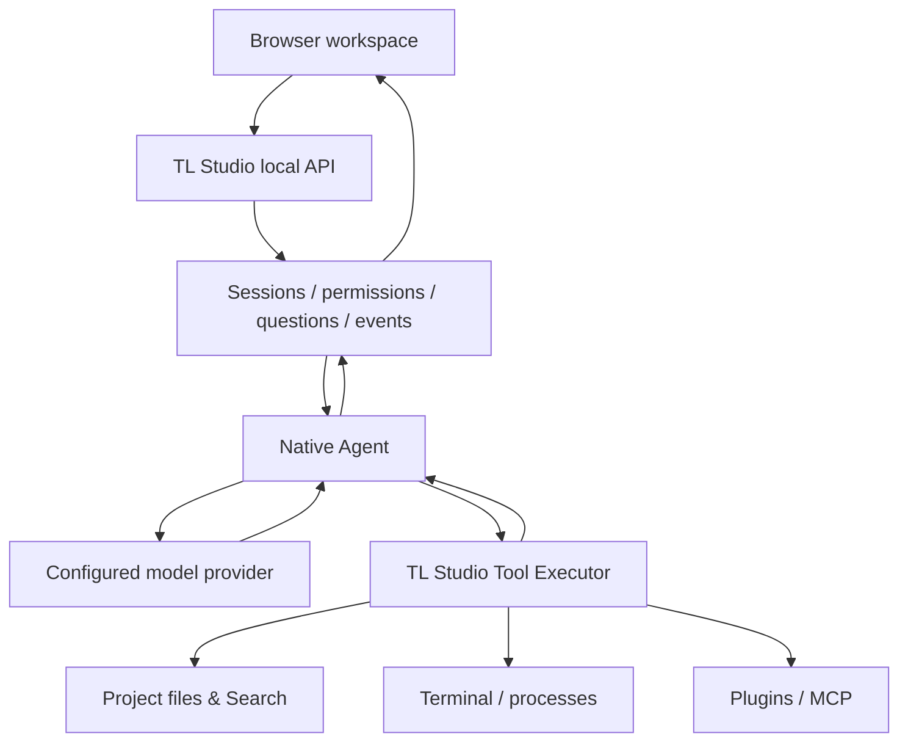

<p align="center" dir="ltr"><a href="./README.md">English</a> · <a href="./README.fa_IR.md">فارسی</a></p>

<p align="center">
  
</p>

<p align="center" dir="rtl">
  <strong>یک محیط کدنویسی محلی با Agent هوش مصنوعی بومی.</strong>
</p>

<p align="center" dir="rtl">
  ویرایش کد، جست‌وجوی پروژه، اجرای دستورها، پیش‌نمایش، استفاده از ابزارها و کار با مدل‌های هوش مصنوعی؛ همه در یک محیط محلی.
</p>

<p align="center">
  <a href="https://www.npmjs.com/package/tl-studio"></a>
  <a href="https://github.com/pouramin/TL-Studio/releases"></a>
  <a href="https://github.com/pouramin/TL-Studio/actions/workflows/ci.yml"></a>
  <a href="https://github.com/pouramin/TL-Studio/releases"></a>
  <a href="./LICENSE"></a>
</p>

<p align="center">
  
  <a href="https://github.com/pouramin/TL-Studio/tree/dev"></a>
</p>

---

<h2 dir="rtl" align="right"><bdi dir="ltr">TL Studio</bdi> چیست؟</h2>

<p dir="rtl" align="right"><strong><bdi dir="ltr">TL Studio</bdi></strong> یک محیط توسعهٔ محلی و مستقل است که حول یک <bdi dir="ltr">Agent</bdi> کدنویسی بومی ساخته شده است.</p>

<p dir="rtl" align="right">محیط مرورگری و <bdi dir="ltr">Backend</bdi> نوشته‌شده با <bdi dir="ltr">Go</bdi> به‌عنوان یک محصول واحد کار می‌کنند. چرخهٔ <bdi dir="ltr">Agent</bdi>، <bdi dir="ltr">Session</bdi>ها، ابزارها، <bdi dir="ltr">Permission</bdi>ها، تنظیمات <bdi dir="ltr">Provider</bdi>، <bdi dir="ltr">Credential</bdi>ها، <bdi dir="ltr">Process</bdi>های <bdi dir="ltr">Terminal</bdi>، فایل‌های پروژه، <bdi dir="ltr">Preview</bdi>، <bdi dir="ltr">Plugin/MCP</bdi> و <bdi dir="ltr">Event</bdi>های معنایی همگی در اختیار خود <bdi dir="ltr">TL Studio</bdi> هستند.</p>

<p dir="rtl" align="right"><bdi dir="ltr">Session</bdi>های کدنویسی از طریق <bdi dir="ltr">Native Agent</bdi> و <bdi dir="ltr">Tool Executor</bdi> خود <bdi dir="ltr">TL Studio</bdi> اجرا می‌شوند.</p>

<p dir="rtl" align="right">پروژه روی سیستم خود کاربر باقی می‌ماند و ترافیک مدل مستقیماً به <bdi dir="ltr">Provider</bdi> انتخاب‌شده ارسال می‌شود.</p>

<h2 dir="rtl" align="right">شروع سریع</h2>

<h3 dir="rtl" align="right">اجرا با <bdi dir="ltr">npm</bdi></h3>

<p dir="rtl" align="right">اگر <bdi dir="ltr">Node.js</bdi> و <bdi dir="ltr">npm</bdi> نصب هستند، داخل پوشهٔ پروژه این دستور را اجرا کنید:</p>

```bash
npx --yes tl-studio
```

<p dir="rtl" align="right">پکیج <bdi dir="ltr">npm</bdi> یک <bdi dir="ltr">Launcher</bdi> سبک برای نسخهٔ پایدار متناظر در <bdi dir="ltr">GitHub Releases</bdi> است. سیستم‌عامل و معماری را تشخیص می‌دهد، آرشیو رسمی <bdi dir="ltr">TL Studio</bdi> را دانلود می‌کند، <bdi dir="ltr">SHA-256</bdi> آن را بررسی می‌کند، فایل را در <bdi dir="ltr">Cache</bdi> محلی نگه می‌دارد و پوشهٔ فعلی را به‌عنوان پروژه باز می‌کند.</p>

<p dir="rtl" align="right">برای اجرا بدون باز شدن خودکار <bdi dir="ltr">Browser:</bdi></p>

```bash
npx --yes tl-studio --no-browser
```

<h3 dir="rtl" align="right">نسخهٔ <bdi dir="ltr">Portable</bdi></h3>

<p dir="rtl" align="right">آخرین نسخهٔ پایدار را از <strong>undefined</strong> دانلود و <bdi dir="ltr">Extract</bdi> کنید:</p>

```text
Windows   tl-studio.exe
Linux     ./tl-studio
macOS     ./tl-studio
```

<p dir="rtl" align="right">برای باز کردن یک پروژهٔ مشخص:</p>

```bash
tl-studio --project /path/to/project
```

<p dir="rtl" align="right">در <bdi dir="ltr">Windows:</bdi></p>

```powershell
.\tl-studio.exe --project C:\path\to\project
```

<h2 dir="rtl" align="right">قابلیت‌های اصلی</h2>

<table dir="rtl">
  <thead>
    <tr>
      <th align="right"></th>
      <th align="right">قابلیت</th>
      <th align="right">توضیح</th>
    </tr>
  </thead>
  <tbody>
    <tr>
      <td align="right">🧠</td>
      <td align="right"><strong><bdi dir="ltr">Native Agent</bdi></strong></td>
      <td align="right">چرخهٔ کامل مدل → ابزار → مدل، لغو اجرا، <bdi dir="ltr">Loop Guard</bdi>، <bdi dir="ltr">Persistence</bdi> و پاسخ نهایی در اختیار <bdi dir="ltr">TL Studio</bdi> است.</td>
    </tr>
    <tr>
      <td align="right">🗂️</td>
      <td align="right"><strong><bdi dir="ltr">Workspace</bdi></strong></td>
      <td align="right"><bdi dir="ltr">File Explorer</bdi>، <bdi dir="ltr">Monaco Editor</bdi>، <bdi dir="ltr">Tab</bdi>ها، ساخت/تغییرنام/حذف/ذخیره و هماهنگی با تغییرات بیرونی فایل‌ها.</td>
    </tr>
    <tr>
      <td align="right">🔎</td>
      <td align="right"><strong><bdi dir="ltr">Project Search</bdi></strong></td>
      <td align="right">جست‌وجوی سراسری در پروژه با فیلترهای <bdi dir="ltr">Include/Exclude</bdi> و باز کردن مستقیم نتیجه.</td>
    </tr>
    <tr>
      <td align="right">💻</td>
      <td align="right"><strong><bdi dir="ltr">Terminal</bdi></strong></td>
      <td align="right">اجرای دستورها در محدودهٔ پروژه، تاریخچهٔ خروجی، <bdi dir="ltr">Stop</bdi> و پایان <bdi dir="ltr">Process Tree</bdi> در سیستم‌های پشتیبانی‌شده.</td>
    </tr>
    <tr>
      <td align="right">👁️</td>
      <td align="right"><strong><bdi dir="ltr">Live Preview</bdi></strong></td>
      <td align="right">پیش‌نمایش <bdi dir="ltr">HTML</bdi>، <bdi dir="ltr">Markdown</bdi>، تصویر، <bdi dir="ltr">PDF</bdi>، <bdi dir="ltr">SVG</bdi>، ویدیو، صدا و متن روی <bdi dir="ltr">Origin</bdi> محلی جداگانه.</td>
    </tr>
    <tr>
      <td align="right">💬</td>
      <td align="right"><strong><bdi dir="ltr">Sessions</bdi></strong></td>
      <td align="right">ساخت، <bdi dir="ltr">Resume</bdi>، <bdi dir="ltr">Rename</bdi>، <bdi dir="ltr">Delete</bdi>، <bdi dir="ltr">Abort</bdi>، <bdi dir="ltr">Persistence</bdi> و مشاهدهٔ تغییرات هر <bdi dir="ltr">Session.</bdi></td>
    </tr>
    <tr>
      <td align="right">❓</td>
      <td align="right"><strong><bdi dir="ltr">Interactive Questions</bdi></strong></td>
      <td align="right"><bdi dir="ltr">Agent</bdi> می‌تواند متوقف شود، سؤال ساختاریافته بپرسد، پاسخ گزینه‌ای یا متن دلخواه بگیرد و همان اجرا را ادامه دهد.</td>
    </tr>
    <tr>
      <td align="right">🔐</td>
      <td align="right"><strong><bdi dir="ltr">Permissions</bdi></strong></td>
      <td align="right">عملیات حساس می‌توانند نیازمند تأیید، <bdi dir="ltr">Allow Once</bdi>، <bdi dir="ltr">Reject</bdi> یا <bdi dir="ltr">Rule</bdi>های <bdi dir="ltr">Project-scoped</bdi> باشند.</td>
    </tr>
    <tr>
      <td align="right">🔌</td>
      <td align="right"><strong><bdi dir="ltr">Providers</bdi></strong></td>
      <td align="right"><bdi dir="ltr">Client</bdi>های مستقیم مدل، <bdi dir="ltr">Provider</bdi> سفارشی و <bdi dir="ltr">Model Discovery.</bdi></td>
    </tr>
    <tr>
      <td align="right">🔑</td>
      <td align="right"><strong><bdi dir="ltr">Credential Vault</bdi></strong></td>
      <td align="right"><bdi dir="ltr">API Key</bdi>ها خارج از <bdi dir="ltr">Browser Storage</bdi> و فایل تعریف <bdi dir="ltr">Provider</bdi> نگهداری می‌شوند.</td>
    </tr>
    <tr>
      <td align="right">🧩</td>
      <td align="right"><strong><bdi dir="ltr">Plugins</bdi> / <bdi dir="ltr">MCP</bdi></strong></td>
      <td align="right">ابزارهای خارجی وارد همان <bdi dir="ltr">Tool Registry</bdi>، مسیر <bdi dir="ltr">Agent</bdi> و مرز <bdi dir="ltr">Permission</bdi> می‌شوند.</td>
    </tr>
    <tr>
      <td align="right">🏠</td>
      <td align="right"><strong><bdi dir="ltr">Local-first</bdi></strong></td>
      <td align="right"><bdi dir="ltr">Backend</bdi> ابری <bdi dir="ltr">TL Studio</bdi>، <bdi dir="ltr">Database</bdi> برنامه، <bdi dir="ltr">Model Proxy</bdi> یا <bdi dir="ltr">Telemetry Service</bdi> لازم نیست.</td>
    </tr>
  </tbody>
</table>

<h2 dir="rtl" align="right">پشتیبانی <bdi dir="ltr">Native</bdi> از <bdi dir="ltr">Provider</bdi>ها</h2>

<p dir="rtl" align="right">نسخهٔ پایدار <strong><bdi dir="ltr">v0.5.0</bdi></strong> برای <bdi dir="ltr">Protocol</bdi>های زیر <bdi dir="ltr">Client</bdi> مستقیم دارد:</p>

<table dir="rtl">
  <thead>
    <tr>
      <th align="right"><bdi dir="ltr">Protocol</bdi></th>
      <th align="right">وضعیت</th>
    </tr>
  </thead>
  <tbody>
    <tr>
      <td align="right"><bdi dir="ltr">OpenAI-compatible Chat Completions</bdi></td>
      <td align="right">✅ پشتیبانی می‌شود</td>
    </tr>
    <tr>
      <td align="right"><bdi dir="ltr">OpenAI Responses</bdi></td>
      <td align="right">✅ پشتیبانی می‌شود</td>
    </tr>
    <tr>
      <td align="right"><bdi dir="ltr">Anthropic Messages</bdi></td>
      <td align="right">✅ پشتیبانی می‌شود</td>
    </tr>
  </tbody>
</table>

<p dir="rtl" align="right">تعریف <bdi dir="ltr">Provider</bdi>ها در اختیار <bdi dir="ltr">TL Studio</bdi> است. <bdi dir="ltr">API Key</bdi>ها به‌صورت جداگانه در <bdi dir="ltr">Credential Vault</bdi> نگهداری می‌شوند و در این محل‌ها نوشته نمی‌شوند:</p>

```text
providers.json
Browser localStorage
sessionStorage
frontend source
normal local API responses
```

<p dir="rtl" align="right">راه‌اندازی <bdi dir="ltr">Provider</bdi> سفارشی به‌صورت <bdi dir="ltr">Discovery-first</bdi> طراحی شده است: <bdi dir="ltr">Endpoint</bdi>، <bdi dir="ltr">Protocol</bdi> و <bdi dir="ltr">Credential</bdi> را تنظیم می‌کنید و <bdi dir="ltr">TL Studio</bdi> فهرست مدل‌ها را از <bdi dir="ltr">API</bdi> سازگار کشف می‌کند.</p>

<p dir="rtl" align="right">مدل یا <bdi dir="ltr">Protocol</bdi> پشتیبانی‌نشده با خطای صریح <bdi dir="ltr">Unsupported Capability</bdi> متوقف می‌شود.</p>

<h3 dir="rtl" align="right"><bdi dir="ltr">Provider Account</bdi></h3>

<p dir="rtl" align="right">نسخهٔ پایدار <strong><bdi dir="ltr">v0.5.0</bdi></strong> زیرساخت عمومی <bdi dir="ltr">Provider Account</bdi> را به‌عنوان مرز توسعهٔ آینده در اختیار دارد، اما <bdi dir="ltr">Login</bdi> با حساب‌های مصرف‌کننده در <bdi dir="ltr">Runtime</bdi> پایدار فعال نیست.</p>

<p dir="rtl" align="right"><bdi dir="ltr">Flow</bdi>های <bdi dir="ltr">OAuth</bdi> خصوصی یا مستندنشده <bdi dir="ltr">Reverse Engineer</bdi> نمی‌شوند.</p>

<p dir="rtl" align="right">پیاده‌سازی‌های جدید <bdi dir="ltr">Account Provider</bdi> روی شاخهٔ توسعه انجام می‌شوند و تنها پس از آماده شدن <bdi dir="ltr">milestone</bdi> بعدی وارد نسخهٔ پایدار خواهند شد.</p>

<p dir="rtl" align="right"><a href="https://github.com/pouramin/TL-Studio/tree/dev">مشاهدهٔ شاخهٔ <bdi dir="ltr">dev</bdi></a></p>

<h2 dir="rtl" align="right">معماری</h2>

<p dir="rtl" align="right"><bdi dir="ltr">TL Studio</bdi> یک مرز محصول بومی و یکپارچه دارد:</p>


```mermaid
flowchart TD
    UI["Browser workspace"] --> API["TL Studio local API"]
    API --> STATE["Sessions / permissions / questions / events"]
    STATE --> AGENT["Native Agent"]

    AGENT --> PROVIDER["Configured model provider"]
    AGENT --> TOOLS["TL Studio Tool Executor"]

    TOOLS --> FILES["Project files & Search"]
    TOOLS --> TERM["Terminal / processes"]
    TOOLS --> MCP["Plugins / MCP"]

    PROVIDER --> AGENT
    TOOLS --> AGENT
    AGENT --> STATE
    STATE --> UI
```

<p dir="rtl" align="right">بخش‌های زیر مستقیماً در اختیار <bdi dir="ltr">TL Studio</bdi> هستند:</p>

<ul dir="rtl">
  <li><bdi dir="ltr">Workspace</bdi> و <bdi dir="ltr">Monaco Editor</bdi></li>
  <li>فایل‌های پروژه و <bdi dir="ltr">Search</bdi></li>
  <li><bdi dir="ltr">Terminal</bdi> و <bdi dir="ltr">Process execution</bdi></li>
  <li><bdi dir="ltr">Preview</bdi></li>
  <li><bdi dir="ltr">Provider Registry</bdi> و <bdi dir="ltr">Model Discovery</bdi></li>
  <li><bdi dir="ltr">Credential Vault</bdi></li>
  <li><bdi dir="ltr">Native Agent</bdi></li>
  <li><bdi dir="ltr">Session</bdi>ها و <bdi dir="ltr">Persistence</bdi></li>
  <li><bdi dir="ltr">Question</bdi>ها و <bdi dir="ltr">Permission</bdi>ها</li>
  <li><bdi dir="ltr">Event</bdi>های معنایی</li>
  <li><bdi dir="ltr">Tool Registry</bdi> و <bdi dir="ltr">Tool Executor</bdi></li>
  <li><bdi dir="ltr">Plugins/MCP</bdi></li>
</ul>

<p dir="rtl" align="right">جزئیات کامل‌تر در این فایل قرار دارد:</p>

<p dir="rtl" align="right"><a href="./docs/ARCHITECTURE.md"><bdi dir="ltr">docs/ARCHITECTURE.md</bdi></a></p>

<h2 dir="rtl" align="right"><bdi dir="ltr">API</bdi> محلی محصول</h2>

<p dir="rtl" align="right"><bdi dir="ltr">Browser</bdi> فقط با <bdi dir="ltr">API</bdi>های معنایی خود <bdi dir="ltr">TL Studio</bdi> ارتباط دارد، از جمله:</p>

```text
/local/status
/local/health
/local/path
/local/agents
/local/providers/*
/local/provider-accounts*
/local/sessions*
/local/questions*
/local/permissions*
/local/events
/local/plugins*
/local/tools
```

<h2 dir="rtl" align="right">امنیت</h2>

<p dir="rtl" align="right"><bdi dir="ltr">Control Surface</bdi> برنامه برای استفادهٔ محلی طراحی شده است:</p>

<ul dir="rtl">
  <li><bdi dir="ltr">Control UI</bdi> فقط روی <bdi dir="ltr">Loopback Bind</bdi> می‌شود.</li>
  <li><bdi dir="ltr">Host</bdi>های غیرمحلی رد می‌شوند.</li>
  <li><bdi dir="ltr">Origin</bdi> مرورگر باید با <bdi dir="ltr">Control Origin</bdi> محلی یکسان باشد.</li>
  <li>عملیات <bdi dir="ltr">Filesystem</bdi> مرز پروژه را <bdi dir="ltr">enforce</bdi> می‌کنند.</li>
  <li><bdi dir="ltr">Traversal</bdi> و <bdi dir="ltr">Symlink Escape</bdi> رد می‌شوند.</li>
  <li><bdi dir="ltr">Preview</bdi> از <bdi dir="ltr">Control Origin</bdi> جداست.</li>
  <li><bdi dir="ltr">Credential</bdi>های <bdi dir="ltr">Provider</bdi> وارد <bdi dir="ltr">Browser Code</bdi> نمی‌شوند.</li>
  <li><bdi dir="ltr">Tool</bdi>های حساس پشت <bdi dir="ltr">Permission</bdi> قرار دارند.</li>
</ul>

<p dir="rtl" align="right"><bdi dir="ltr">Provider</bdi>های خارجی، <bdi dir="ltr">Repository</bdi>ها، <bdi dir="ltr">Prompt</bdi>ها، <bdi dir="ltr">MCP Server</bdi>ها و <bdi dir="ltr">Plugin Process</bdi>ها مرزهای اعتماد مستقل هستند.</p>

<p dir="rtl" align="right"><bdi dir="ltr">Control Port</bdi> برنامه را از طریق <bdi dir="ltr">Public Proxy</bdi> در معرض اینترنت قرار ندهید.</p>

<p dir="rtl" align="right">جزئیات بیشتر:</p>

<p dir="rtl" align="right"><a href="./SECURITY.md"><bdi dir="ltr">SECURITY.md</bdi></a></p>

<h2 dir="rtl" align="right">نسخه‌های قابل اجرا</h2>

<table dir="rtl">
  <thead>
    <tr>
      <th align="right">پلتفرم</th>
      <th align="right">معماری</th>
    </tr>
  </thead>
  <tbody>
    <tr>
      <td align="right"><bdi dir="ltr">Windows</bdi></td>
      <td align="right"><bdi dir="ltr">x64</bdi></td>
    </tr>
    <tr>
      <td align="right"><bdi dir="ltr">Linux</bdi></td>
      <td align="right"><bdi dir="ltr">x64</bdi>, <bdi dir="ltr">ARM64</bdi></td>
    </tr>
    <tr>
      <td align="right"><bdi dir="ltr">macOS</bdi></td>
      <td align="right"><bdi dir="ltr">Intel x64</bdi>, <bdi dir="ltr">Apple Silicon ARM64</bdi></td>
    </tr>
  </tbody>
</table>

<p dir="rtl" align="right">نسخه‌های پایدار همراه با <bdi dir="ltr">SHA-256</bdi> از طریق <strong>undefined</strong> منتشر می‌شوند.</p>

<h2 dir="rtl" align="right"><bdi dir="ltr">Build</bdi> از <bdi dir="ltr">Source</bdi></h2>

<h3 dir="rtl" align="right">نیازمندی‌ها</h3>

```text
Go 1.23+
Node.js 18+
npm
```

<p dir="rtl" align="right">نصب وابستگی‌های <bdi dir="ltr">Build</bdi> رابط <bdi dir="ltr">Browser:</bdi></p>

```bash
npm install --ignore-scripts --no-audit --no-fund
```

<p dir="rtl" align="right"><bdi dir="ltr">Type-check</bdi> و <bdi dir="ltr">Build</bdi> رابط <bdi dir="ltr">Browser:</bdi></p>

```bash
npm run check:web
npm run build:web
```

<p dir="rtl" align="right">اجرای <bdi dir="ltr">Test</bdi>ها و <bdi dir="ltr">Vet:</bdi></p>

```bash
go test ./...
go vet ./...
```

<p dir="rtl" align="right">اجرای <bdi dir="ltr">TL Studio:</bdi></p>

```bash
go run ./cmd/launcher --project /path/to/project
```

<p dir="rtl" align="right">ساخت <bdi dir="ltr">Binary</bdi> محلی:</p>

```bash
go build -o tl-studio ./cmd/launcher
```

<p dir="rtl" align="right">در <bdi dir="ltr">Windows:</bdi></p>

```powershell
go build -o tl-studio.exe ./cmd/launcher
```

<p dir="rtl" align="right">اجرای عادی برنامه همان <bdi dir="ltr">Native Execution</bdi> است و <bdi dir="ltr">Runtime</bdi> خارجی دیگری لازم نیست.</p>

<h2 dir="rtl" align="right">اعتبارسنجی</h2>

<p dir="rtl" align="right">نسخهٔ پایدار <bdi dir="ltr">TL Studio</bdi> به‌عنوان یک محصول کامل تست می‌شود، نه فقط مجموعه‌ای از <bdi dir="ltr">Package</bdi>ها.</p>

<p dir="rtl" align="right">بررسی‌های <bdi dir="ltr">Repository</bdi>، بسته به نوع تغییر، شامل این موارد هستند:</p>

<ul dir="rtl">
  <li><bdi dir="ltr">Type-check</bdi> سخت‌گیرانهٔ <bdi dir="ltr">TypeScript</bdi> برای <bdi dir="ltr">Browser</bdi></li>
  <li><bdi dir="ltr">Build</bdi> نهایی <bdi dir="ltr">Browser</bdi></li>
  <li><code dir="ltr">go test ./...</code></li>
  <li><code dir="ltr">go vet ./...</code></li>
  <li><bdi dir="ltr">Cross-compile</bdi> برای پلتفرم‌های پشتیبانی‌شده</li>
  <li><bdi dir="ltr">Native Product Contract</bdi></li>
  <li><bdi dir="ltr">Custom Provider Contract</bdi></li>
  <li><bdi dir="ltr">Browser Smoke</bdi></li>
  <li><bdi dir="ltr">Agent E2E</bdi></li>
  <li><bdi dir="ltr">Windows x64 Review Package</bdi></li>
  <li>بررسی <bdi dir="ltr">Release</bdi> و <bdi dir="ltr">Review Package</bdi></li>
</ul>

<p dir="rtl" align="right">در تست <bdi dir="ltr">Provider</bdi>ها از <bdi dir="ltr">Credential</bdi> واقعی کاربران استفاده نمی‌شود و <bdi dir="ltr">Endpoint</bdi>های <bdi dir="ltr">Mock</bdi> جایگزین می‌شوند.</p>

<h2 dir="rtl" align="right">شاخه‌ها و کانال انتشار</h2>

<table dir="rtl">
  <thead>
    <tr>
      <th align="right">شاخه</th>
      <th align="right">کاربرد</th>
    </tr>
  </thead>
  <tbody>
    <tr>
      <td align="right"><code dir="ltr">main</code></td>
      <td align="right">نسخهٔ پایدار</td>
    </tr>
    <tr>
      <td align="right"><code dir="ltr">dev</code></td>
      <td align="right">توسعهٔ نسخهٔ بعدی</td>
    </tr>
    <tr>
      <td align="right"><bdi dir="ltr">Feature Branch</bdi></td>
      <td align="right">تغییرات متمرکز برای یک قابلیت یا <bdi dir="ltr">Milestone</bdi></td>
    </tr>
  </tbody>
</table>

<p dir="rtl" align="right">نسخهٔ پایدار فعلی:</p>

```text
v0.5.0
```

<p dir="rtl" align="right">نسخهٔ پایدار فقط پس از عبور از <bdi dir="ltr">Validation</bdi> خودکار و <bdi dir="ltr">Review</bdi> دستی منتشر می‌شود. تغییرات شاخهٔ <bdi dir="ltr">dev</bdi> تا زمان <bdi dir="ltr">Promotion</bdi> رسمی، نسخهٔ <bdi dir="ltr">npm</bdi> پایدار یا <bdi dir="ltr">GitHub Release</bdi> پایدار را تغییر نمی‌دهند.</p>

<h2 dir="rtl" align="right">اصول پروژه</h2>

<ol dir="rtl">
  <li><strong><bdi dir="ltr">Local-first</bdi></strong> — <bdi dir="ltr">Source Code</bdi> و <bdi dir="ltr">Workspace</bdi> روی سیستم کاربر باقی می‌مانند.</li>
  <li><strong><bdi dir="ltr">Native execution</bdi></strong> — چرخهٔ <bdi dir="ltr">Agent</bdi> و <bdi dir="ltr">Tool</bdi> متعلق به خود <bdi dir="ltr">TL Studio</bdi> است.</li>
  <li><strong>مرز اعتماد شفاف</strong> — <bdi dir="ltr">Credential</bdi>ها، <bdi dir="ltr">Provider</bdi>ها، <bdi dir="ltr">Permission</bdi>ها، <bdi dir="ltr">Repository</bdi>ها و <bdi dir="ltr">Tool</bdi>های خارجی مرز مشخص دارند.</li>
  <li><strong>مرز قابلیت شفاف</strong> — قابلیت پشتیبانی‌نشده به‌صورت واضح <bdi dir="ltr">Fail</bdi> می‌شود و با چیز دیگری جایگزین نمی‌شود.</li>
  <li><strong>توزیع <bdi dir="ltr">Portable</bdi></strong> — <bdi dir="ltr">Build</bdi> پایدار برای <bdi dir="ltr">Windows</bdi>، <bdi dir="ltr">Linux</bdi> و <bdi dir="ltr">macOS</bdi> منتشر می‌شود.</li>
  <li><strong>بدون زیرساخت اختصاصی پروژه</strong> — <bdi dir="ltr">Backend</bdi> میزبانی‌شده، <bdi dir="ltr">Database</bdi>، <bdi dir="ltr">Telemetry Service</bdi> یا <bdi dir="ltr">Model Proxy</bdi> برای استفاده از <bdi dir="ltr">TL Studio</bdi> لازم نیست.</li>
</ol>

<h2 dir="rtl" align="right">ساختار <bdi dir="ltr">Repository</bdi></h2>

```text
cmd/launcher/          Go application, local APIs, Agent, providers, tools
cmd/launcher/ui/       Browser TypeScript source
docs/                  Architecture and design documentation
media/                 Project branding
packaging/             Release/package support
scripts/               Browser build and launcher tooling
third_party/           Required third-party notices/licenses
```

<p dir="rtl" align="right">اسناد مهم:</p>

<ul dir="rtl">
  <li><a href="./docs/ARCHITECTURE.md">معماری</a></li>
  <li><a href="./SECURITY.md">امنیت</a></li>
  <li><a href="./README.md"><bdi dir="ltr">README</bdi> انگلیسی</a></li>
  <li><a href="./THIRD_PARTY_NOTICES.md"><bdi dir="ltr">Third-party notices</bdi></a></li>
  <li><a href="https://github.com/pouramin/TL-Studio/tree/dev">شاخهٔ توسعه</a></li>
</ul>

<h2 dir="rtl" align="right"><bdi dir="ltr">License</bdi></h2>

<p dir="rtl" align="right"><bdi dir="ltr">TL Studio</bdi> تحت <strong><bdi dir="ltr">MIT License</bdi></strong> منتشر می‌شود.</p>

<p dir="rtl" align="right">فایل‌های مربوط:</p>

<p dir="rtl" align="right"><a href="./LICENSE"><bdi dir="ltr">LICENSE</bdi></a></p>

<p dir="rtl" align="right"><a href="./THIRD_PARTY_NOTICES.md"><bdi dir="ltr">THIRD_PARTY_NOTICES.md</bdi></a></p>

---

<p dir="rtl" align="right"><<bdi dir="ltr">p align</bdi>="<bdi dir="ltr">center</bdi>"> ساخته‌شده تحت هویت <<bdi dir="ltr">strong</bdi>><bdi dir="ltr">TunnelLab</bdi></<bdi dir="ltr">strong</bdi>>. </<bdi dir="ltr">p</bdi>></p>
