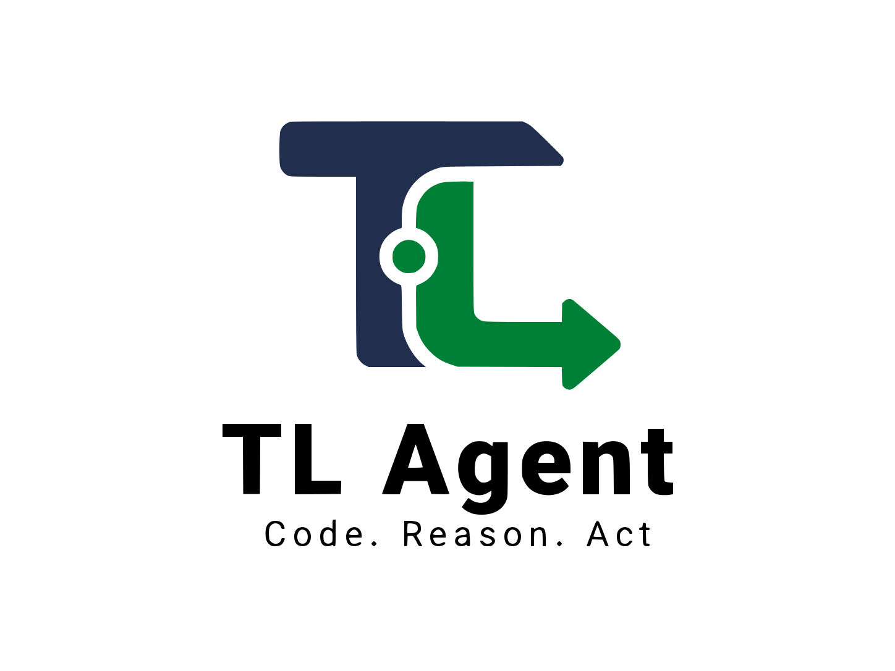

[English](./README.md) | [فارسی](./README.fa_IR.md)

<p align="center">
  
</p>

<h1 align="center">TL Agent</h1>

<p align="center">
  A local, standalone coding-agent workspace — no IDE required.
</p>

<p align="center">
  <a href="https://github.com/pouramin/TL-Agent/releases"></a>
  <a href="https://github.com/pouramin/TL-Agent/actions/workflows/ci.yml"></a>
  <a href="https://github.com/pouramin/TL-Agent/releases"></a>
  <a href="./LICENSE"></a>
</p>

**TL Agent** gives coding agents a dedicated browser workspace for local projects. Open a folder, choose an agent and model, attach files, inspect tool activity and changes, manage sessions, answer permission requests, and keep the entire workspace on your own computer.

No VS Code, JetBrains, Cursor, Docker, hosted TL Agent backend, database, or project-owned cloud service is required.

## Quick Start

### One-command launch

If Node.js/npm is installed, run this inside the project directory you want to work on:

```bash
npx --yes github:pouramin/TL-Agent
```

The lightweight launcher detects the operating system and architecture, downloads the matching release, verifies its SHA-256 checksum, caches it locally, and opens TL Agent with the current directory selected.

### Portable release

For the normal portable build, Node.js is not required. Download your platform archive from **[GitHub Releases](https://github.com/pouramin/TL-Agent/releases)**, extract it, and run:

```text
Windows:  tl-agent.exe
Linux:    ./tl-agent
macOS:    ./tl-agent
```

The release already includes the pinned local agent runtime.

## Features

- **Standalone local workspace** — a dedicated coding-agent UI in the browser without an IDE.
- **Local project picker** — open project folders with the operating-system folder picker.
- **Agent & model selection** — switch agents and available provider models from the composer.
- **Custom providers** — connect OpenAI-compatible, OpenAI Responses, and Anthropic-compatible endpoints with your own credentials.
- **File attachments** — attach images, PDFs, and text/code files; multi-select, drag/drop, and clipboard paste are supported.
- **Live agent activity** — compact Reasoning and Tool cards with live status updates.
- **Permissions & questions** — approve one-time actions, save matching rules when supported, reject actions, and answer interactive questions.
- **Stop & recovery** — interrupt active work and recover from stalled or retryable upstream failures.
- **Session management** — create, resume, rename, delete, and switch sessions across recent projects.
- **Project-scoped usage** — per-turn and project totals for tokens, requests, time, reasoning, and cache usage.
- **Changes panel** — inspect changed files, addition/deletion counts, and patches.
- **Project file explorer** — read-only local file navigation and preview.
- **Appearance settings** — System, Dark, and Light themes plus interface font-size controls.
- **Local-first security** — loopback-only UI, random per-run backend password, origin checks, and restrictive CSP.
- **No TL Agent telemetry or cloud service** — model traffic goes directly through the provider/runtime configuration selected by the user.

## Architecture

```text
Browser workspace
    │ localhost only
    ▼
TL Agent launcher (Go)
    │ authenticated local reverse proxy
    ▼
Local agent runtime
    │
    ├─ agents / sessions / tools
    ├─ permissions / questions / live events
    ├─ project files / terminal commands
    └─ configured AI providers
```

TL Agent owns the workspace, product UI, local launcher, project/session experience, provider configuration, recovery behavior, and release packaging. The runtime remains a replaceable infrastructure layer behind that product boundary.

The selected project stays on the user's computer, and TL Agent does not proxy model traffic through project-owned infrastructure.

## Runtime & compatibility

The current bundled runtime is **Kilo Code**, pinned to a tested version in [`KILO_VERSION`](./KILO_VERSION). Runtime-specific compatibility details are kept in [`docs/KILO_API_CONTRACT.md`](./docs/KILO_API_CONTRACT.md) instead of being part of the product-facing UI contract.

CI validates the real pinned runtime for project routing, agent/provider/session APIs, async prompts, live events, permissions, provider configuration, tool execution, and real file writes against a local test model server.

## Supported builds

| Platform | Architecture |
| --- | --- |
| Windows | x64 |
| Linux | x64, ARM64 |
| macOS | Intel x64, Apple Silicon ARM64 |

## Release package

```text
tl-agent/
├─ tl-agent[.exe]
├─ bin/
│  └─ kilo[.exe]
├─ LICENSE
├─ THIRD_PARTY_NOTICES.md
└─ third_party/
   └─ KILO_LICENSE.txt
```

## Run from source

Development requirements:

- Go 1.23+
- the compatible local runtime binary in `PATH`, beside the launcher, or supplied explicitly

```bash
go run ./cmd/launcher
```

Open a specific project:

```bash
go run ./cmd/launcher --project /path/to/project
```

Use a specific runtime binary:

```bash
go run ./cmd/launcher --kilo /path/to/kilo
```

Use `--no-browser` to suppress automatic browser launch.

## Zero-infrastructure rule

TL Agent is intentionally designed so the maintainer does not need to pay for a VPS, application hosting, database, API gateway, model inference, or telemetry backend. Source, issues, CI, release definitions, and downloadable builds live on GitHub.

Any paid AI usage is between the user and the provider they configure.

## Security model

The launcher:

1. binds the UI to loopback only (`127.0.0.1`, `localhost`, or `::1`),
2. starts the local runtime on loopback with a random per-run password,
3. keeps that password server-side,
4. routes the selected project directory locally,
5. rejects cross-origin browser requests, and
6. serves the UI with a restrictive Content Security Policy.

The agent runtime can read/write files and execute commands when permissions allow it. Only run TL Agent on projects and machines you trust.

## Status

TL Agent is currently an **early alpha**. The core path is validated in CI and on a real Windows machine:

```text
TL Agent UI
→ local agent runtime
→ selected model
→ tool call
→ permission
→ local file write
→ final assistant response
```

## License & attribution

TL Agent launcher/UI code is MIT licensed. The bundled Kilo Code runtime is also MIT licensed and remains a separate upstream project. Release archives retain its license notice; see [`THIRD_PARTY_NOTICES.md`](./THIRD_PARTY_NOTICES.md).

TL Agent is an independent project and is not an official product of its runtime upstream.

Built under the **TunnelLab** identity.
