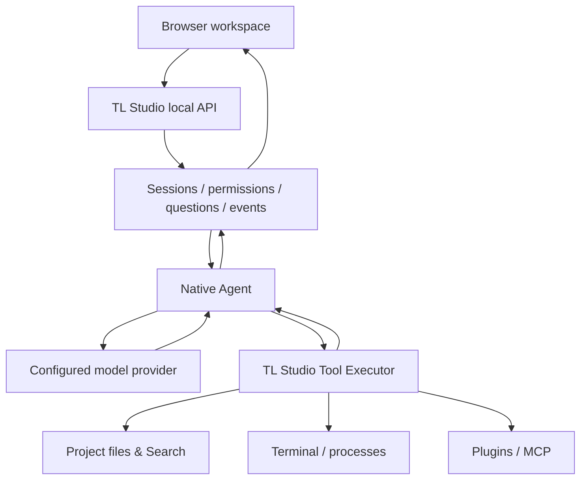

[English](./README.md) · [فارسی](./README.fa_IR.md)

<p align="center">
  
</p>

<p align="center">
  <strong>A local-first coding workspace with a native AI agent.</strong>
</p>

<p align="center">
  Edit code, search projects, run commands, preview apps, use tools, and work with AI models — from one local workspace.
</p>

<p align="center">
  <a href="https://www.npmjs.com/package/tl-studio"></a>
  <a href="https://github.com/pouramin/TL-Studio/releases"></a>
  <a href="https://github.com/pouramin/TL-Studio/actions/workflows/ci.yml"></a>
  <a href="https://github.com/pouramin/TL-Studio/releases"></a>
  <a href="./LICENSE"></a>
</p>

<p align="center">
  
  <a href="https://github.com/pouramin/TL-Studio/tree/dev"></a>
</p>

---

## TL Studio

**TL Studio** is a standalone local development environment built around a native coding agent.

The Browser workspace and Go backend work as one product. TL Studio owns the Agent loop, sessions, tools, permissions, provider configuration, credentials, terminal processes, project files, Preview, Plugins/MCP, and semantic events.

TL Studio executes coding sessions through its own Native Agent and Tool Executor.

Your project stays on your machine, and model traffic goes directly to the provider you configure.

## Quick start

### Run with npm

With Node.js and npm installed, open a terminal inside the project you want to work on:

```bash
npx --yes tl-studio
```

The npm package is a lightweight launcher for the matching stable GitHub release. It detects your platform, downloads the official TL Studio archive, verifies its SHA-256 checksum, caches it locally, and opens the current directory as the project.

Start without automatically opening the browser:

```bash
npx --yes tl-studio --no-browser
```

### Portable release

Download the latest stable build from **[GitHub Releases](https://github.com/pouramin/TL-Studio/releases)**, extract it, and run:

```text
Windows   tl-studio.exe
Linux     ./tl-studio
macOS     ./tl-studio
```

Open a specific project:

```bash
tl-studio --project /path/to/project
```

Windows:

```powershell
.\tl-studio.exe --project C:\path\to\project
```

## What you get

| | Capability | Description |
| --- | --- | --- |
| 🧠 | **Native Agent** | TL Studio owns the full model → tool → model execution loop, cancellation, loop guards, persistence, and final response. |
| 🗂️ | **Workspace** | File explorer, Monaco editor, tabs, create/rename/delete/save actions, and external-change reconciliation. |
| 🔎 | **Project Search** | Search across the project with include/exclude filtering and click-to-open results. |
| 💻 | **Terminal** | Project-scoped command execution, output history, stop controls, and process-tree termination where supported. |
| 👁️ | **Live Preview** | Preview HTML, Markdown, images, PDF, SVG, video, audio, and text through an isolated local origin. |
| 💬 | **Sessions** | Create, resume, rename, delete, abort, persist, and inspect Agent sessions and file changes. |
| ❓ | **Interactive questions** | The Agent can pause, ask a structured question, accept choices or custom text, and continue the same run. |
| 🔐 | **Permissions** | Sensitive actions can require approval, allow-once decisions, rejection, and project-scoped remembered rules. |
| 🔌 | **Providers** | Native direct model clients plus custom provider configuration and model discovery. |
| 🔑 | **Credential vault** | Provider API keys stay outside Browser storage and provider definition files. |
| 🧩 | **Plugins / MCP** | External tools join the same Tool Registry, Agent path, and permission boundary. |
| 🏠 | **Local-first** | No hosted TL Studio backend, application database, model proxy, or telemetry service is required. |

## Native provider support

Stable **v0.5.0** includes direct model clients for:

| Protocol | Status |
| --- | --- |
| OpenAI-compatible Chat Completions | ✅ Supported |
| OpenAI Responses | ✅ Supported |
| Anthropic Messages | ✅ Supported |

Provider definitions are owned by TL Studio. API keys are stored separately in the TL Studio credential vault and are not written to:

- `providers.json`;
- Browser local storage;
- session storage;
- frontend source;
- normal local API responses.

Custom provider setup is discovery-first: configure the endpoint, protocol, and credential, then TL Studio discovers available models from compatible model-list APIs.

Unsupported models or protocols return an explicit unsupported-capability error.

### Provider accounts

Stable v0.5.0 includes the generic Provider Account architecture as a future-facing boundary, but does **not** enable consumer-account login providers in the stable runtime.

Private or undocumented OAuth flows are not reverse-engineered.

Account-provider implementations under active development live on the **[`dev` branch](https://github.com/pouramin/TL-Studio/tree/dev)** and are promoted only when the next milestone is ready for stable release.

## Architecture

TL Studio is one native product boundary:


```mermaid
flowchart TD
    UI["Browser workspace"] --> API["TL Studio local API"]
    API --> STATE["Sessions / permissions / questions / events"]
    STATE --> AGENT["Native Agent"]

    AGENT --> PROVIDER["Configured model provider"]
    AGENT --> TOOLS["TL Studio Tool Executor"]

    TOOLS --> FILES["Project files & Search"]
    TOOLS --> TERM["Terminal / processes"]
    TOOLS --> MCP["Plugins / MCP"]

    PROVIDER --> AGENT
    TOOLS --> AGENT
    AGENT --> STATE
    STATE --> UI
```

TL Studio owns:

- workspace and Monaco editor;
- project files and Search;
- Terminal/process execution;
- Preview;
- provider registry and model discovery;
- credential vault;
- Native Agent execution;
- sessions and persistence;
- questions and permissions;
- semantic live events;
- Tool Registry and Tool Executor;
- Plugins/MCP.

For implementation details, see **[docs/ARCHITECTURE.md](./docs/ARCHITECTURE.md)**.

## Local product API

The Browser talks to TL Studio-owned semantic endpoints, including:

```text
/local/status
/local/health
/local/path
/local/agents
/local/providers/*
/local/provider-accounts*
/local/sessions*
/local/questions*
/local/permissions*
/local/events
/local/plugins*
/local/tools
```

The historical generic `/runtime/*` reverse-proxy surface is not part of the product.

## Security

TL Studio is designed to keep its control surface local:

- the control UI binds to loopback;
- non-loopback Host values are rejected;
- Browser Origin must match the local control origin;
- filesystem APIs enforce project boundaries;
- traversal and symlink escapes are rejected;
- Preview is isolated from the control origin;
- provider credentials remain outside Browser code;
- sensitive tools remain permission-gated.

External model providers, repositories, prompts, MCP servers, and plugin processes are separate trust boundaries.

Do not expose the TL Studio control port through a public proxy.

See **[SECURITY.md](./SECURITY.md)** for security details and reporting guidance.

## Supported builds

| Platform | Architecture |
| --- | --- |
| Windows | x64 |
| Linux | x64, ARM64 |
| macOS | Intel x64, Apple Silicon ARM64 |

Stable archives are published through **[GitHub Releases](https://github.com/pouramin/TL-Studio/releases)** with SHA-256 checksums.

## Build from source

### Requirements

- Go 1.23+
- Node.js 18+
- npm

Install Browser build dependencies:

```bash
npm install --ignore-scripts --no-audit --no-fund
```

Type-check and build the Browser:

```bash
npm run check:web
npm run build:web
```

Run tests and vet:

```bash
go test ./...
go vet ./...
```

Run TL Studio:

```bash
go run ./cmd/launcher --project /path/to/project
```

Build a local executable:

```bash
go build -o tl-studio ./cmd/launcher
```

Windows:

```powershell
go build -o tl-studio.exe ./cmd/launcher
```

Normal execution is native. There is no native-only flag and no external coding-runtime binary to install.

## Validation

Stable TL Studio is validated as a product, not only as a collection of packages.

Repository checks include, as applicable:

- strict Browser TypeScript type-check;
- Browser production build;
- `go test ./...`;
- `go vet ./...`;
- supported launcher cross-compiles;
- Native Product Contract;
- Custom Provider Contract;
- Browser smoke testing;
- Agent/runtime E2E;
- Windows x64 review packaging;
- review and release package validation.

Provider integration tests use mocked endpoints rather than real user credentials.

## Release channels

| Branch | Purpose |
| --- | --- |
| `main` | Stable production releases |
| `dev` | Active next-version development |
| feature branches | Focused work based on the appropriate target branch |

The current stable release is **v0.5.0**.

Stable releases are promoted only after automated validation and hands-on review. Development work on `dev` does not change the stable npm launcher or GitHub stable release until a milestone is explicitly promoted.

## Project principles

1. **Local-first** — source code and workspace state stay on the user's machine.
2. **Native execution** — TL Studio owns the Agent and tool loop.
3. **Explicit trust boundaries** — credentials, providers, permissions, repositories, and external tools remain clearly separated.
4. **Explicit capability boundaries** — unsupported capabilities fail clearly instead of being silently substituted.
5. **Portable distribution** — stable builds are published for Windows, Linux, and macOS.
6. **Zero project-owned infrastructure** — TL Studio does not require a hosted application backend, database, telemetry service, or model proxy.

## Repository map

```text
cmd/launcher/          Go application, local APIs, Agent, providers, tools
cmd/launcher/ui/       Browser TypeScript source
docs/                  Architecture and design documentation
media/                 Project branding
packaging/             Release/package support
scripts/               Browser build and launcher tooling
third_party/           Required third-party notices/licenses
```

Useful documents:

- **[Architecture](./docs/ARCHITECTURE.md)**
- **[Security](./SECURITY.md)**
- **[Persian README](./README.fa_IR.md)**
- **[Third-party notices](./THIRD_PARTY_NOTICES.md)**
- **[Development branch](https://github.com/pouramin/TL-Studio/tree/dev)**

## License

TL Studio is released under the **MIT License**.

See **[LICENSE](./LICENSE)** and **[THIRD_PARTY_NOTICES.md](./THIRD_PARTY_NOTICES.md)**.

---

<p align="center">
  Built under the <strong>TunnelLab</strong> identity.
</p>
