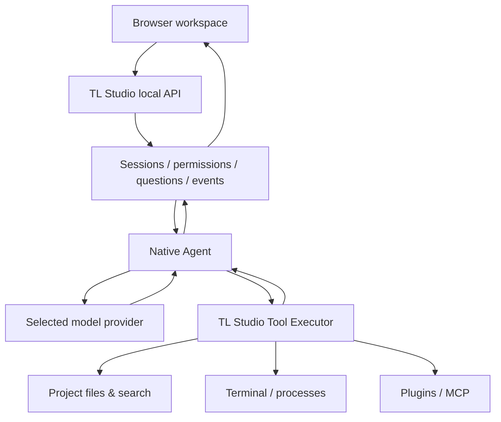

[English](./README.md) · [فارسی](./README.fa_IR.md)

<p align="center">
  
</p>

<p align="center">
  <strong>A local-first coding workspace with a native AI agent.</strong>
</p>

<p align="center">
  Edit, search, run, preview, chat, use tools, and connect models — all from one TL Studio workspace on your own machine.
</p>

<p align="center">
  <a href="https://www.npmjs.com/package/tl-studio"></a>
  <a href="https://github.com/pouramin/TL-Studio/releases"></a>
  <a href="https://github.com/pouramin/TL-Studio/actions/workflows/ci.yml"></a>
  <a href="https://github.com/pouramin/TL-Studio/releases"></a>
  <a href="./LICENSE"></a>
</p>

<p align="center">
  
  
</p>

---

## What is TL Studio?

**TL Studio** is a standalone local development environment built around a native coding agent.

It combines a browser-based workspace with a Go backend that owns the Agent loop, sessions, tools, permissions, providers, credentials, terminal processes, project files, Preview, Plugins/MCP, and semantic events.

TL Studio executes coding sessions through its own Native Agent and Tool Executor.

Your project stays on your machine. Model traffic goes directly to the provider you configure.

## Quick start

### Run with npm

If Node.js and npm are installed, open a terminal inside your project directory and run:

```bash
npx --yes tl-studio
```

The npm package is a lightweight launcher for the matching **stable** TL Studio release. It downloads the official binary for your platform, verifies its SHA-256 checksum, caches it locally, and starts TL Studio with the current directory selected.

To start without opening the browser automatically:

```bash
npx --yes tl-studio --no-browser
```

### Portable release

Download the latest stable archive from **[GitHub Releases](https://github.com/pouramin/TL-Studio/releases)**, extract it, and run:

```text
Windows   tl-studio.exe
Linux     ./tl-studio
macOS     ./tl-studio
```

You can also open a project explicitly:

```bash
tl-studio --project /path/to/project
```

On Windows:

```powershell
.\tl-studio.exe --project C:\path\to\project
```

## Highlights

| | Capability | What it means |
| --- | --- | --- |
| 🧠 | **Native Agent** | TL Studio owns the complete model → tool → model loop, cancellation, loop guards, persistence, and final response. |
| 🗂️ | **Workspace** | File explorer, Monaco editor, tabs, project search, file operations, and external-change reconciliation. |
| 💻 | **Terminal** | Project-scoped command execution with output history, cancellation, and process-tree termination where supported. |
| 👁️ | **Live Preview** | Preview HTML, Markdown, images, PDF, video, audio, SVG, and text through an isolated loopback origin. |
| 🔐 | **Permissions** | Sensitive tool actions can pause for approval, allow-once decisions, rejection, and project-scoped remembered rules. |
| 💬 | **Interactive questions** | The Agent can pause, ask structured questions, accept choices or custom text, and continue the same run. |
| 🔌 | **Providers** | Direct native clients for OpenAI-compatible, OpenAI Responses, Anthropic Messages, and Google Gemini. |
| 👤 | **Provider accounts** | Supported providers can use account-backed authentication without exposing credentials to Browser code. |
| 🧩 | **Plugins / MCP** | External tools join the same TL Studio Tool Registry and permission boundary. |
| 📚 | **Sessions** | Create, rename, resume, delete, abort, persist, and inspect Agent sessions and file changes. |
| 📊 | **Usage** | Session activity and usage metadata stay part of TL Studio's semantic session model. |
| 🏠 | **Local-first** | No TL Studio cloud backend, database, hosted proxy, or telemetry service is required. |

## Provider support

TL Studio keeps **manual API credentials** and **account credentials** in separate credential-vault slots. Connecting an account can take precedence while it is active, but signing out does not delete an existing manual API key.

Secrets are not stored in `providers.json`, Browser local storage, session storage, frontend source, or normal local API responses.

### Native model protocols

| Protocol | Status |
| --- | --- |
| OpenAI-compatible Chat Completions | ✅ Supported |
| OpenAI Responses | ✅ Supported |
| Anthropic Messages | ✅ Supported |
| Google Gemini `generateContent` | ✅ Supported |

Custom providers use a discovery-first setup: normally you provide an API address, API type, and API key, and TL Studio discovers available models automatically. Manual model entry remains an explicit fallback for private or unlisted models.

### Provider connections

The compact Provider cards use the connection method that matches the product:

| Provider | Default setup | Status |
| --- | --- | --- |
| **ChatGPT / Codex** | Account sign-in | ✅ Available through OpenAI's official Codex login/model surface. |
| **GitHub Copilot** | Account sign-in | ⏳ Account slot reserved; model integration remains deferred. |
| **Claude / Anthropic** | API key | ✅ Opens the Anthropic API configuration directly. |
| **Google / Gemini** | API key | ✅ Uses Google's documented OpenAI-compatible Gemini endpoint. |
| **Hugging Face** | API token | ✅ Uses the OpenAI-compatible Inference Providers router. |
| **OpenRouter** | API key | ✅ Uses the OpenAI-compatible OpenRouter API. |

Providers that use API credentials are **not** shown as unavailable just because they do not use consumer-account OAuth. Their cards open the existing discovery-first API configuration flow with the correct endpoint/protocol preset.

The ChatGPT integration uses OpenAI's official Codex CLI/App Server surface. TL Studio never copies ChatGPT cookies, browser sessions, private OAuth clients, or undocumented backend tokens. Codex authentication is isolated under TL Studio's own `CODEX_HOME`; the Browser sees only semantic account state.

For ChatGPT-plan model turns, TL Studio invokes the official Codex CLI in ephemeral, read-only bridge mode with user/project Codex configuration ignored. The structured result is converted back into TL Studio model text or TL Studio Tool calls, so permission checks, Tool execution, Session persistence, and the outer model → tool → model loop remain owned by TL Studio.

If `codex` is not already on `PATH`, TL Studio can use `npx @openai/codex`; Provider Settings also accepts an explicit Codex executable path.

### Gemini alpha setup

The current 0.6 development line lets users configure these **non-secret** values directly in Provider Settings:

- Google Cloud Project ID
- Desktop OAuth Client ID

OAuth access and refresh tokens stay only in the TL Studio credential vault.

Gemini desktop login uses a temporary listener bound to:

```text
127.0.0.1:<random-port>
```

The listener validates OAuth state, completes the PKCE flow, and shuts down after success, cancellation, or expiry.

## Architecture

TL Studio is one native product boundary.


```mermaid
flowchart TD
    UI["Browser workspace"] --> API["TL Studio local API"]
    API --> SESSION["Sessions / permissions / questions / events"]
    SESSION --> AGENT["Native Agent"]
    AGENT --> PROVIDER["Selected model provider"]
    AGENT --> TOOLS["TL Studio Tool Executor"]

    TOOLS --> FILES["Project files & search"]
    TOOLS --> TERM["Terminal / processes"]
    TOOLS --> MCP["Plugins / MCP"]

    PROVIDER --> AGENT
    TOOLS --> AGENT
    AGENT --> SESSION
    SESSION --> UI
```

TL Studio owns:

- workspace and Monaco editor;
- files and project Search;
- Terminal/process execution;
- Preview;
- provider registry and model discovery;
- credential vault;
- Provider Account lifecycle;
- Native Agent execution;
- sessions and persistence;
- questions and permissions;
- semantic live events;
- Tool Registry and Tool Executor;
- Plugins/MCP.

Unsupported model protocols return an explicit unsupported-capability error.

For the deeper design, see **[docs/ARCHITECTURE.md](./docs/ARCHITECTURE.md)**.

## Security model

The local control surface is designed to stay local:

- the control UI binds to loopback;
- non-loopback Host values are rejected;
- Browser Origin must match the local control origin;
- filesystem operations enforce project boundaries;
- traversal and symlink escapes are rejected;
- Preview is isolated from the control origin;
- provider secrets remain outside Browser code;
- sensitive tools remain permission-gated.

External model providers, repositories, prompts, MCP servers, and plugin processes are separate trust boundaries.

Do not expose the TL Studio control port through a public proxy.

See **[SECURITY.md](./SECURITY.md)** for the security model and reporting guidance.

## Supported builds

| Platform | Architecture |
| --- | --- |
| Windows | x64 |
| Linux | x64, ARM64 |
| macOS | Intel x64, Apple Silicon ARM64 |

Stable releases are published through **[GitHub Releases](https://github.com/pouramin/TL-Studio/releases)** with SHA-256 checksums.

## Build from source

### Requirements

- Go 1.23+
- Node.js 18+
- npm

Install Browser development dependencies:

```bash
npm install --ignore-scripts --no-audit --no-fund
```

Type-check and build the Browser:

```bash
npm run check:web
npm run build:web
```

Run backend tests and vet:

```bash
go test ./...
go vet ./...
```

Run TL Studio:

```bash
go run ./cmd/launcher --project /path/to/project
```

Build a local executable:

```bash
go build -o tl-studio ./cmd/launcher
```

Windows:

```powershell
go build -o tl-studio.exe ./cmd/launcher
```

Normal execution is already native. There is no special native-mode flag and no external coding-runtime binary to install.

## Validation

The repository's automated validation covers the product rather than only compiling individual packages.

Current gates include, as applicable:

- Browser strict TypeScript type-check;
- Browser production build;
- `go test ./...`;
- `go vet ./...`;
- supported launcher cross-compiles;
- Native Product Contract;
- Custom Provider Contract;
- Browser smoke testing;
- Agent/runtime E2E;
- provider-specific regression tests;
- Windows x64 review packaging;
- review and release package validation.

Real credentials are not used in CI; provider integrations are exercised through mocked endpoints and contract tests.

## Release channels

| Branch / channel | Purpose | Current version |
| --- | --- | --- |
| `main` | Stable production | **v0.5.0** |
| `dev` | Active development | **v0.6.0-alpha.1** |
| Feature branches | Focused work based on current `dev` | Short-lived |

Stable releases are promoted to `main` only after the milestone has passed automated validation and hands-on review.

The stable npm launcher follows stable releases. Development builds are produced separately from `dev`.

## Project principles

TL Studio is intentionally built around a few hard boundaries:

1. **Local-first** — the workspace and project stay on the user's machine.
2. **Native execution** — TL Studio owns the Agent and tool loop.
3. **Explicit trust** — credentials, permissions, providers, and external tools have clear boundaries.
4. **Explicit capability boundaries** — unsupported capabilities fail clearly instead of being silently substituted.
5. **Discovery-first provider setup** — common provider configuration should be simple.
6. **Portable by default** — stable binaries are distributed for Windows, Linux, and macOS.
7. **Zero project-owned infrastructure** — TL Studio does not require a hosted application backend, database, telemetry service, or model proxy.

## Repository map

```text
cmd/launcher/          Go application, local APIs, Agent, providers, tools
cmd/launcher/ui/       Browser TypeScript source
docs/                  Architecture and design documentation
media/                 Project branding
packaging/             Release/package support
scripts/               Browser build and launcher tooling
third_party/           Required third-party notices/licenses
```

Important documents:

- **[Architecture](./docs/ARCHITECTURE.md)**
- **[Security](./SECURITY.md)**
- **[Persian README](./README.fa_IR.md)**
- **[Third-party notices](./THIRD_PARTY_NOTICES.md)**

## License

TL Studio is released under the **MIT License**.

See **[LICENSE](./LICENSE)** and **[THIRD_PARTY_NOTICES.md](./THIRD_PARTY_NOTICES.md)**.

---

<p align="center">
  Built under the <strong>TunnelLab</strong> identity.
</p>
